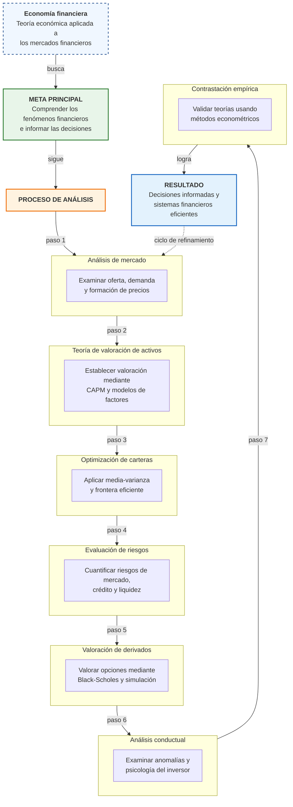

```mermaid
flowchart TD
    A[<b>Economía financiera</b><br>Teoría económica aplicada a<br>los mercados financieros]:::title
    B[<b>META PRINCIPAL</b><br>Comprender los fenómenos financieros<br>e informar las decisiones]:::goal
    C[<b>PROCESO DE ANÁLISIS</b>]:::process
    
    subgraph D[Análisis de mercado]
        D1[Examinar oferta, demanda<br>y formación de precios]
    end
    
    subgraph E[Teoría de valoración de activos]
        E1[Establecer valoración mediante<br>CAPM y modelos de factores]
    end
    
    subgraph F[Optimización de carteras]
        F1[Aplicar media-varianza<br>y frontera eficiente]
    end
    
    subgraph G[Evaluación de riesgos]
        G1[Cuantificar riesgos de mercado,<br>crédito y liquidez]
    end
    
    subgraph H[Valoración de derivados]
        H1[Valorar opciones mediante<br>Black-Scholes y simulación]
    end
    
    subgraph I[Análisis conductual]
        I1[Examinar anomalías y<br>psicología del inversor]
    end
    
    subgraph J[Contrastación empírica]
        J1[Validar teorías usando<br>métodos econométricos]
    end
    
    K[<b>RESULTADO</b><br>Decisiones informadas y<br>sistemas financieros eficientes]:::outcome
    
    A -->|busca| B
    B -->|sigue| C
    C -->|paso 1| D
    D -->|paso 2| E
    E -->|paso 3| F
    F -->|paso 4| G
    G -->|paso 5| H
    H -->|paso 6| I
    I -->|paso 7| J
    J -->|logra| K
    K -.->|ciclo de refinamiento| D
    
    classDef title fill:#f0f7ff,stroke:#4a6fa5,stroke-width:2px,color:#333,stroke-dasharray:5 5
    classDef goal fill:#e8f5e9,stroke:#2e7d32,stroke-width:2px,color:#333
    classDef process fill:#fff3e0,stroke:#ef6c00,stroke-width:2px,color:#333
    classDef outcome fill:#e3f2fd,stroke:#1565c0,stroke-width:2px,color:#333
```
