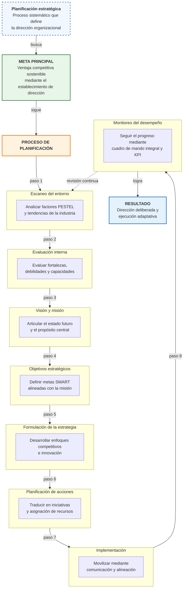

```mermaid
flowchart TD
    A[<b>Planificación estratégica</b><br>Proceso sistemático que define<br>la dirección organizacional]:::title
    B[<b>META PRINCIPAL</b><br>Ventaja competitiva sostenible<br>mediante el establecimiento de dirección]:::goal
    C[<b>PROCESO DE PLANIFICACIÓN</b>]:::process
    
    subgraph D[Escaneo del entorno]
        D1[Analizar factores PESTEL<br>y tendencias de la industria]
    end
    
    subgraph E[Evaluación interna]
        E1[Evaluar fortalezas,<br>debilidades y capacidades]
    end
    
    subgraph F[Visión y misión]
        F1[Articular el estado futuro<br>y el propósito central]
    end
    
    subgraph G[Objetivos estratégicos]
        G1[Definir metas SMART<br>alineadas con la misión]
    end
    
    subgraph H[Formulación de la estrategia]
        H1[Desarrollar enfoques competitivos<br>e innovación]
    end
    
    subgraph I[Planificación de acciones]
        I1[Traducir en iniciativas<br>y asignación de recursos]
    end
    
    subgraph J[Implementación]
        J1[Movilizar mediante<br>comunicación y alineación]
    end
    
    subgraph K[Monitoreo del desempeño]
        K1[Seguir el progreso mediante<br>cuadro de mando integral y KPI]
    end
    
    L[<b>RESULTADO</b><br>Dirección deliberada y<br>ejecución adaptativa]:::outcome
    
    A -->|busca| B
    B -->|sigue| C
    C -->|paso 1| D
    D -->|paso 2| E
    E -->|paso 3| F
    F -->|paso 4| G
    G -->|paso 5| H
    H -->|paso 6| I
    I -->|paso 7| J
    J -->|paso 8| K
    K -->|logra| L
    K -.->|revisión continua| D
    
    classDef title fill:#f0f7ff,stroke:#4a6fa5,stroke-width:2px,color:#333,stroke-dasharray:5 5
    classDef goal fill:#e8f5e9,stroke:#2e7d32,stroke-width:2px,color:#333
    classDef process fill:#fff3e0,stroke:#ef6c00,stroke-width:2px,color:#333
    classDef outcome fill:#e3f2fd,stroke:#1565c0,stroke-width:2px,color:#333
```
