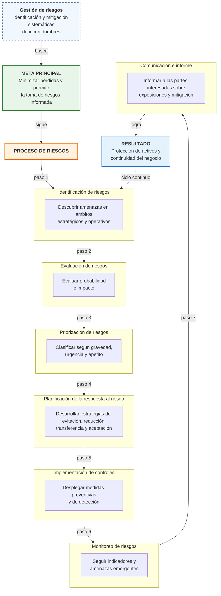

```mermaid
flowchart TD
    A[<b>Gestión de riesgos</b><br>Identificación y mitigación sistemáticas<br>de incertidumbres]:::title
    B[<b>META PRINCIPAL</b><br>Minimizar pérdidas y permitir<br>la toma de riesgos informada]:::goal
    C[<b>PROCESO DE RIESGOS</b>]:::process
    
    subgraph D[Identificación de riesgos]
        D1[Descubrir amenazas en ámbitos<br>estratégicos y operativos]
    end
    
    subgraph E[Evaluación de riesgos]
        E1[Evaluar probabilidad<br>e impacto]
    end
    
    subgraph F[Priorización de riesgos]
        F1[Clasificar según gravedad,<br>urgencia y apetito]
    end
    
    subgraph G[Planificación de la respuesta al riesgo]
        G1[Desarrollar estrategias de evitación, reducción,<br>transferencia y aceptación]
    end
    
    subgraph H[Implementación de controles]
        H1[Desplegar medidas preventivas<br>y de detección]
    end
    
    subgraph I[Monitoreo de riesgos]
        I1[Seguir indicadores y<br>amenazas emergentes]
    end
    
    subgraph J[Comunicación e informe]
        J1[Informar a las partes interesadas sobre<br>exposiciones y mitigación]
    end
    
    K[<b>RESULTADO</b><br>Protección de activos y<br>continuidad del negocio]:::outcome
    
    A -->|busca| B
    B -->|sigue| C
    C -->|paso 1| D
    D -->|paso 2| E
    E -->|paso 3| F
    F -->|paso 4| G
    G -->|paso 5| H
    H -->|paso 6| I
    I -->|paso 7| J
    J -->|logra| K
    K -.->|ciclo continuo| D
    
    classDef title fill:#f0f7ff,stroke:#4a6fa5,stroke-width:2px,color:#333,stroke-dasharray:5 5
    classDef goal fill:#e8f5e9,stroke:#2e7d32,stroke-width:2px,color:#333
    classDef process fill:#fff3e0,stroke:#ef6c00,stroke-width:2px,color:#333
    classDef outcome fill:#e3f2fd,stroke:#1565c0,stroke-width:2px,color:#333
```
