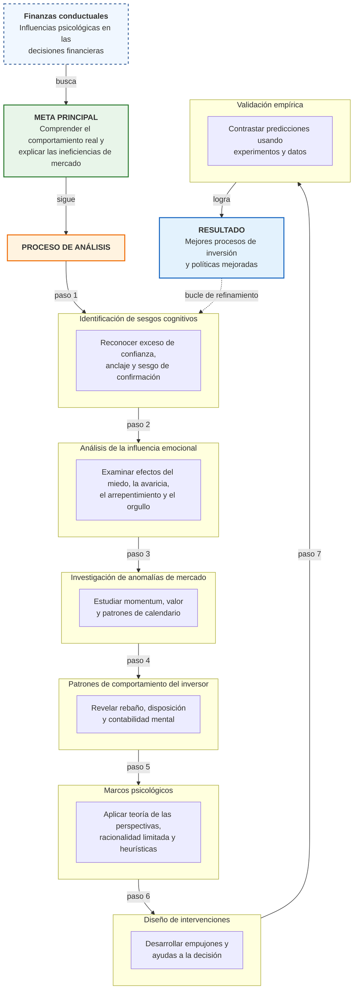

```mermaid
flowchart TD
    A[<b>Finanzas conductuales</b><br>Influencias psicológicas en las<br>decisiones financieras]:::title
    B[<b>META PRINCIPAL</b><br>Comprender el comportamiento real y<br>explicar las ineficiencias de mercado]:::goal
    C[<b>PROCESO DE ANÁLISIS</b>]:::process
    
    subgraph D[Identificación de sesgos cognitivos]
        D1[Reconocer exceso de confianza,<br>anclaje y sesgo de confirmación]
    end
    
    subgraph E[Análisis de la influencia emocional]
        E1[Examinar efectos del miedo, la avaricia,<br>el arrepentimiento y el orgullo]
    end
    
    subgraph F[Investigación de anomalías de mercado]
        F1[Estudiar momentum, valor<br>y patrones de calendario]
    end
    
    subgraph G[Patrones de comportamiento del inversor]
        G1[Revelar rebaño, disposición<br>y contabilidad mental]
    end
    
    subgraph H[Marcos psicológicos]
        H1[Aplicar teoría de las perspectivas,<br>racionalidad limitada y heurísticas]
    end
    
    subgraph I[Diseño de intervenciones]
        I1[Desarrollar empujones y<br>ayudas a la decisión]
    end
    
    subgraph J[Validación empírica]
        J1[Contrastar predicciones usando<br>experimentos y datos]
    end
    
    K[<b>RESULTADO</b><br>Mejores procesos de inversión<br>y políticas mejoradas]:::outcome
    
    A -->|busca| B
    B -->|sigue| C
    C -->|paso 1| D
    D -->|paso 2| E
    E -->|paso 3| F
    F -->|paso 4| G
    G -->|paso 5| H
    H -->|paso 6| I
    I -->|paso 7| J
    J -->|logra| K
    K -.->|bucle de refinamiento| D
    
    classDef title fill:#f0f7ff,stroke:#4a6fa5,stroke-width:2px,color:#333,stroke-dasharray:5 5
    classDef goal fill:#e8f5e9,stroke:#2e7d32,stroke-width:2px,color:#333
    classDef process fill:#fff3e0,stroke:#ef6c00,stroke-width:2px,color:#333
    classDef outcome fill:#e3f2fd,stroke:#1565c0,stroke-width:2px,color:#333
```
