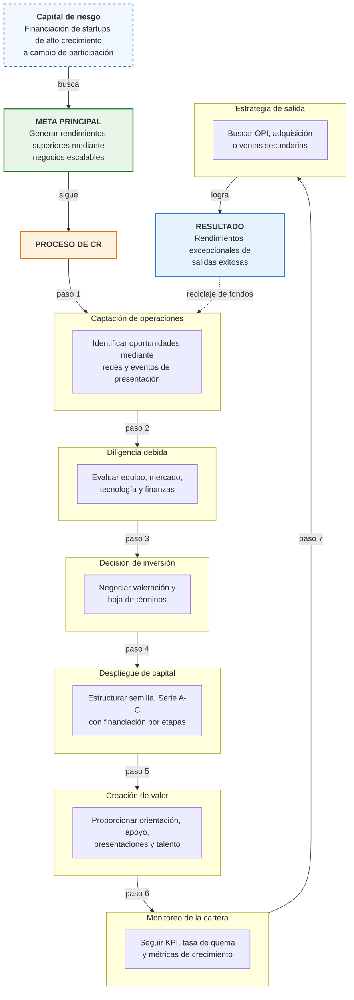

```mermaid
flowchart TD
    A[<b>Capital de riesgo</b><br>Financiación de startups de alto crecimiento<br>a cambio de participación]:::title
    B[<b>META PRINCIPAL</b><br>Generar rendimientos superiores mediante<br>negocios escalables]:::goal
    C[<b>PROCESO DE CR</b>]:::process
    
    subgraph D[Captación de operaciones]
        D1[Identificar oportunidades mediante<br>redes y eventos de presentación]
    end
    
    subgraph E[Diligencia debida]
        E1[Evaluar equipo, mercado,<br>tecnología y finanzas]
    end
    
    subgraph F[Decisión de inversión]
        F1[Negociar valoración y<br>hoja de términos]
    end
    
    subgraph G[Despliegue de capital]
        G1[Estructurar semilla, Serie A-C<br>con financiación por etapas]
    end
    
    subgraph H[Creación de valor]
        H1[Proporcionar orientación, apoyo,<br>presentaciones y talento]
    end
    
    subgraph I[Monitoreo de la cartera]
        I1[Seguir KPI, tasa de quema<br>y métricas de crecimiento]
    end
    
    subgraph J[Estrategia de salida]
        J1[Buscar OPI, adquisición<br>o ventas secundarias]
    end
    
    K[<b>RESULTADO</b><br>Rendimientos excepcionales de<br>salidas exitosas]:::outcome
    
    A -->|busca| B
    B -->|sigue| C
    C -->|paso 1| D
    D -->|paso 2| E
    E -->|paso 3| F
    F -->|paso 4| G
    G -->|paso 5| H
    H -->|paso 6| I
    I -->|paso 7| J
    J -->|logra| K
    K -.->|reciclaje de fondos| D
    
    classDef title fill:#f0f7ff,stroke:#4a6fa5,stroke-width:2px,color:#333,stroke-dasharray:5 5
    classDef goal fill:#e8f5e9,stroke:#2e7d32,stroke-width:2px,color:#333
    classDef process fill:#fff3e0,stroke:#ef6c00,stroke-width:2px,color:#333
    classDef outcome fill:#e3f2fd,stroke:#1565c0,stroke-width:2px,color:#333
```
