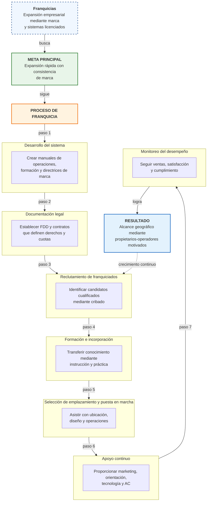

```mermaid
flowchart TD
    A[<b>Franquicias</b><br>Expansión empresarial mediante marca<br>y sistemas licenciados]:::title
    B[<b>META PRINCIPAL</b><br>Expansión rápida con consistencia<br>de marca]:::goal
    C[<b>PROCESO DE FRANQUICIA</b>]:::process
    
    subgraph D[Desarrollo del sistema]
        D1[Crear manuales de operaciones,<br>formación y directrices de marca]
    end
    
    subgraph E[Documentación legal]
        E1[Establecer FDD y contratos<br>que definen derechos y cuotas]
    end
    
    subgraph F[Reclutamiento de franquiciados]
        F1[Identificar candidatos cualificados<br>mediante cribado]
    end
    
    subgraph G[Formación e incorporación]
        G1[Transferir conocimiento mediante<br>instrucción y práctica]
    end
    
    subgraph H[Selección de emplazamiento y puesta en marcha]
        H1[Asistir con ubicación,<br>diseño y operaciones]
    end
    
    subgraph I[Apoyo continuo]
        I1[Proporcionar marketing, orientación,<br>tecnología y AC]
    end
    
    subgraph J[Monitoreo del desempeño]
        J1[Seguir ventas, satisfacción<br>y cumplimiento]
    end
    
    K[<b>RESULTADO</b><br>Alcance geográfico mediante<br>propietarios-operadores motivados]:::outcome
    
    A -->|busca| B
    B -->|sigue| C
    C -->|paso 1| D
    D -->|paso 2| E
    E -->|paso 3| F
    F -->|paso 4| G
    G -->|paso 5| H
    H -->|paso 6| I
    I -->|paso 7| J
    J -->|logra| K
    K -.->|crecimiento continuo| F
    
    classDef title fill:#f0f7ff,stroke:#4a6fa5,stroke-width:2px,color:#333,stroke-dasharray:5 5
    classDef goal fill:#e8f5e9,stroke:#2e7d32,stroke-width:2px,color:#333
    classDef process fill:#fff3e0,stroke:#ef6c00,stroke-width:2px,color:#333
    classDef outcome fill:#e3f2fd,stroke:#1565c0,stroke-width:2px,color:#333
```
