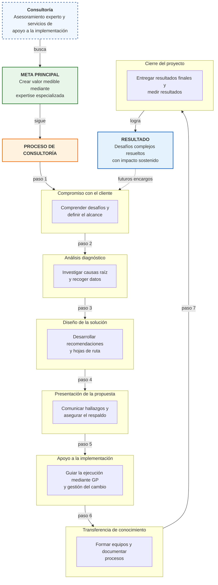

```mermaid
flowchart TD
    A[<b>Consultoría</b><br>Asesoramiento experto y servicios de<br>apoyo a la implementación]:::title
    B[<b>META PRINCIPAL</b><br>Crear valor medible mediante<br>expertise especializada]:::goal
    C[<b>PROCESO DE CONSULTORÍA</b>]:::process
    
    subgraph D[Compromiso con el cliente]
        D1[Comprender desafíos y<br>definir el alcance]
    end
    
    subgraph E[Análisis diagnóstico]
        E1[Investigar causas raíz<br>y recoger datos]
    end
    
    subgraph F[Diseño de la solución]
        F1[Desarrollar recomendaciones<br>y hojas de ruta]
    end
    
    subgraph G[Presentación de la propuesta]
        G1[Comunicar hallazgos y<br>asegurar el respaldo]
    end
    
    subgraph H[Apoyo a la implementación]
        H1[Guiar la ejecución mediante GP<br>y gestión del cambio]
    end
    
    subgraph I[Transferencia de conocimiento]
        I1[Formar equipos y documentar<br>procesos]
    end
    
    subgraph J[Cierre del proyecto]
        J1[Entregar resultados finales y<br>medir resultados]
    end
    
    K[<b>RESULTADO</b><br>Desafíos complejos resueltos<br>con impacto sostenido]:::outcome
    
    A -->|busca| B
    B -->|sigue| C
    C -->|paso 1| D
    D -->|paso 2| E
    E -->|paso 3| F
    F -->|paso 4| G
    G -->|paso 5| H
    H -->|paso 6| I
    I -->|paso 7| J
    J -->|logra| K
    K -.->|futuros encargos| D
    
    classDef title fill:#f0f7ff,stroke:#4a6fa5,stroke-width:2px,color:#333,stroke-dasharray:5 5
    classDef goal fill:#e8f5e9,stroke:#2e7d32,stroke-width:2px,color:#333
    classDef process fill:#fff3e0,stroke:#ef6c00,stroke-width:2px,color:#333
    classDef outcome fill:#e3f2fd,stroke:#1565c0,stroke-width:2px,color:#333
```
