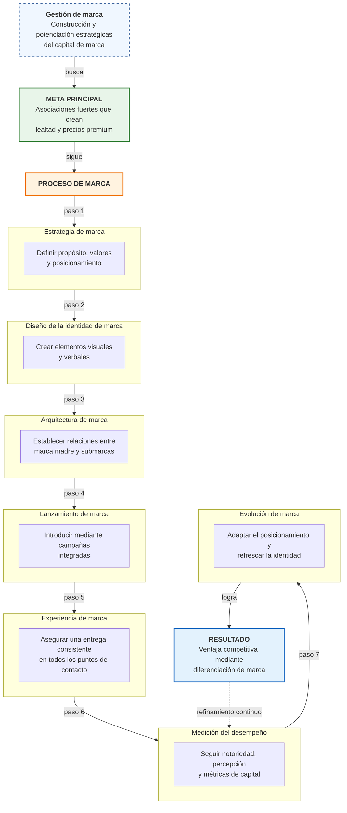

```mermaid
flowchart TD
    A[<b>Gestión de marca</b><br>Construcción y potenciación estratégicas<br>del capital de marca]:::title
    B[<b>META PRINCIPAL</b><br>Asociaciones fuertes que crean<br>lealtad y precios premium]:::goal
    C[<b>PROCESO DE MARCA</b>]:::process
    
    subgraph D[Estrategia de marca]
        D1[Definir propósito, valores<br>y posicionamiento]
    end
    
    subgraph E[Diseño de la identidad de marca]
        E1[Crear elementos visuales<br>y verbales]
    end
    
    subgraph F[Arquitectura de marca]
        F1[Establecer relaciones entre<br>marca madre y submarcas]
    end
    
    subgraph G[Lanzamiento de marca]
        G1[Introducir mediante campañas<br>integradas]
    end
    
    subgraph H[Experiencia de marca]
        H1[Asegurar una entrega consistente<br>en todos los puntos de contacto]
    end
    
    subgraph I[Medición del desempeño]
        I1[Seguir notoriedad, percepción<br>y métricas de capital]
    end
    
    subgraph J[Evolución de marca]
        J1[Adaptar el posicionamiento y<br>refrescar la identidad]
    end
    
    K[<b>RESULTADO</b><br>Ventaja competitiva mediante<br>diferenciación de marca]:::outcome
    
    A -->|busca| B
    B -->|sigue| C
    C -->|paso 1| D
    D -->|paso 2| E
    E -->|paso 3| F
    F -->|paso 4| G
    G -->|paso 5| H
    H -->|paso 6| I
    I -->|paso 7| J
    J -->|logra| K
    K -.->|refinamiento continuo| I
    
    classDef title fill:#f0f7ff,stroke:#4a6fa5,stroke-width:2px,color:#333,stroke-dasharray:5 5
    classDef goal fill:#e8f5e9,stroke:#2e7d32,stroke-width:2px,color:#333
    classDef process fill:#fff3e0,stroke:#ef6c00,stroke-width:2px,color:#333
    classDef outcome fill:#e3f2fd,stroke:#1565c0,stroke-width:2px,color:#333
```
