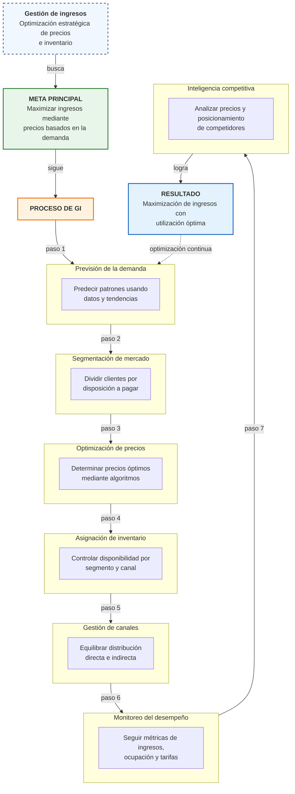

```mermaid
flowchart TD
    A[<b>Gestión de ingresos</b><br>Optimización estratégica de precios<br>e inventario]:::title
    B[<b>META PRINCIPAL</b><br>Maximizar ingresos mediante<br>precios basados en la demanda]:::goal
    C[<b>PROCESO DE GI</b>]:::process
    
    subgraph D[Previsión de la demanda]
        D1[Predecir patrones usando<br>datos y tendencias]
    end
    
    subgraph E[Segmentación de mercado]
        E1[Dividir clientes por<br>disposición a pagar]
    end
    
    subgraph F[Optimización de precios]
        F1[Determinar precios óptimos<br>mediante algoritmos]
    end
    
    subgraph G[Asignación de inventario]
        G1[Controlar disponibilidad por<br>segmento y canal]
    end
    
    subgraph H[Gestión de canales]
        H1[Equilibrar distribución<br>directa e indirecta]
    end
    
    subgraph I[Monitoreo del desempeño]
        I1[Seguir métricas de ingresos,<br>ocupación y tarifas]
    end
    
    subgraph J[Inteligencia competitiva]
        J1[Analizar precios y posicionamiento<br>de competidores]
    end
    
    K[<b>RESULTADO</b><br>Maximización de ingresos con<br>utilización óptima]:::outcome
    
    A -->|busca| B
    B -->|sigue| C
    C -->|paso 1| D
    D -->|paso 2| E
    E -->|paso 3| F
    F -->|paso 4| G
    G -->|paso 5| H
    H -->|paso 6| I
    I -->|paso 7| J
    J -->|logra| K
    K -.->|optimización continua| D
    
    classDef title fill:#f0f7ff,stroke:#4a6fa5,stroke-width:2px,color:#333,stroke-dasharray:5 5
    classDef goal fill:#e8f5e9,stroke:#2e7d32,stroke-width:2px,color:#333
    classDef process fill:#fff3e0,stroke:#ef6c00,stroke-width:2px,color:#333
    classDef outcome fill:#e3f2fd,stroke:#1565c0,stroke-width:2px,color:#333
```
