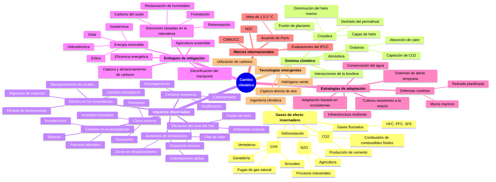

```mermaid
mindmap
  root((<b>Cambio<br>climático</b>))
    <b>Gases de efecto invernadero</b>
      Dióxido de carbono (CO2)
        Combustión de combustibles fósiles
        Deforestación
        Producción de cemento
      Metano (CH4)
        Ganadería
        Arrozales
        Vertederos
        Fugas de gas natural
      Óxido nitroso (N2O)
        Agricultura
        Procesos industriales
      Gases fluorados
        HFC, PFC, SF6
    <b>Sistema climático</b>
      Atmósfera
      Océanos
        Absorción de calor
        Captación de CO2
      Criosfera
        Fusión de glaciares
        Capas de hielo
        Disminución del hielo marino
        Deshielo del permafrost
      Interacciones de la biosfera
    <b>Impactos observados</b>
      Aumentos de temperatura
        Calentamiento global
        Olas de calor
        Zonas en desplazamiento
      Cambios en la precipitación
        Patrones alterados
        Sequías
        Inundaciones
      Elevación del nivel del mar
        Expansión térmica
        Fusión de hielo
        Amenazas costeras
      Clima extremo
        Huracanes
        Incendios forestales
        Tormentas
      Cambios oceánicos
        Acidificación
        Calentamiento
        Desoxigenación
      Efectos en los ecosistemas
        Migración de especies
        Cambios fenológicos
        Blanqueamiento de corales
        Pérdida de biodiversidad
    <b>Enfoques de mitigación</b>
      Energía renovable
        Solar
        Eólica
        Hidroeléctrica
        Geotérmica
      Eficiencia energética
      Electrificación del transporte
      Captura y almacenamiento de carbono
      Soluciones basadas en la naturaleza
        Reforestación
        Forestación
        Restauración de humedales
        Carbono del suelo
      Agricultura sostenible
    <b>Estrategias de adaptación</b>
      Infraestructura resiliente
      Sistemas de alerta temprana
      Conservación del agua
      Cultivos resistentes a la sequía
      Defensas costeras
        Muros marinos
        Retirada planificada
      Adaptación basada en ecosistemas
    <b>Marcos internacionales</b>
      CMNUCC
      Acuerdo de París
        Meta de 1,5-2 °C
      Evaluaciones del IPCC
      NDC
    <b>Tecnologías emergentes</b>
      Captura directa de aire
      Hidrógeno verde
      Utilización de carbono
      Ingeniería climática
```
