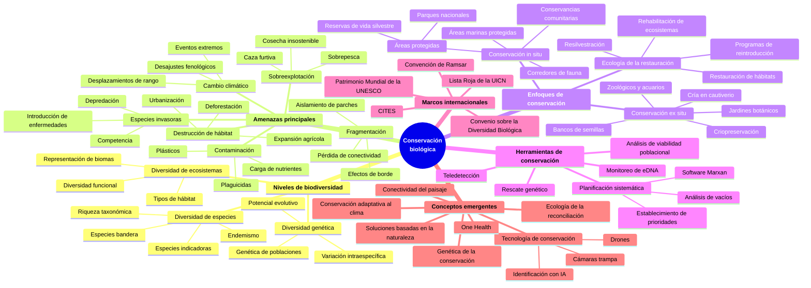

```mermaid
mindmap
  root((<b>Conservación<br>biológica</b>))
    <b>Niveles de biodiversidad</b>
      Diversidad genética
        Variación intraespecífica
        Genética de poblaciones
        Potencial evolutivo
      Diversidad de especies
        Riqueza taxonómica
        Endemismo
        Especies bandera
        Especies indicadoras
      Diversidad de ecosistemas
        Tipos de hábitat
        Representación de biomas
        Diversidad funcional
    <b>Amenazas principales</b>
      Destrucción de hábitat
        Deforestación
        Urbanización
        Expansión agrícola
      Fragmentación
        Aislamiento de parches
        Efectos de borde
        Pérdida de conectividad
      Sobreexplotación
        Sobrepesca
        Caza furtiva
        Cosecha insostenible
      Especies invasoras
        Competencia
        Depredación
        Introducción de enfermedades
      Contaminación
        Plaguicidas
        Plásticos
        Carga de nutrientes
      Cambio climático
        Desplazamientos de rango
        Desajustes fenológicos
        Eventos extremos
    <b>Enfoques de conservación</b>
      Conservación in situ
        Áreas protegidas
          Parques nacionales
          Reservas de vida silvestre
        Corredores de fauna
        Áreas marinas protegidas
        Conservancias comunitarias
      Conservación ex situ
        Zoológicos y acuarios
        Jardines botánicos
        Bancos de semillas
        Cría en cautiverio
        Criopreservación
      Ecología de la restauración
        Restauración de hábitats
        Programas de reintroducción
        Resilvestración
        Rehabilitación de ecosistemas
    <b>Herramientas de conservación</b>
      Planificación sistemática
        Análisis de vacíos
        Establecimiento de prioridades
        Software Marxan
      Análisis de viabilidad poblacional
      Rescate genético
      Monitoreo de eDNA
      Teledetección
    <b>Marcos internacionales</b>
      Lista Roja de la UICN
      Convenio sobre la Diversidad Biológica
      CITES
      Convención de Ramsar
      Patrimonio Mundial de la UNESCO
    <b>Conceptos emergentes</b>
      Genética de la conservación
      Conectividad del paisaje
      Conservación adaptativa al clima
      Soluciones basadas en la naturaleza
      Ecología de la reconciliación
      Tecnología de conservación
        Cámaras trampa
        Drones
        Identificación con IA
      One Health
```
