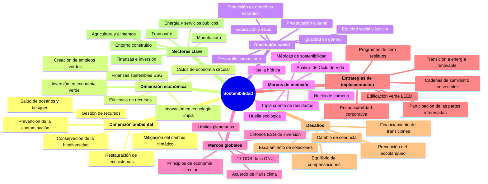

```mermaid
mindmap
  root((<b>Sostenibilidad</b>))
    <b>Dimensión ambiental</b>
      Mitigación del cambio climático
      Conservación de la biodiversidad
      Gestión de recursos
      Prevención de la contaminación
      Restauración de ecosistemas
      Salud de océanos y bosques
    <b>Dimensión económica</b>
      Ciclos de economía circular
      Inversión en economía verde
      Finanzas sostenibles ESG
      Eficiencia de recursos
      Innovación en tecnología limpia
      Creación de empleos verdes
    <b>Dimensión social</b>
      Equidad social y justicia
      Desarrollo comunitario
      Protección de derechos laborales
      Educación y salud
      Preservación cultural
      Igualdad de género
    <b>Marcos de medición</b>
      Análisis de Ciclo de Vida
      Huella de carbono
      Huella hídrica
      Huella ecológica
      Triple cuenta de resultados
      Métricas de sostenibilidad
    <b>Marcos globales</b>
      17 ODS de la ONU
      Acuerdo de París clima
      Principios de economía circular
      Criterios ESG de inversión
      Límites planetarios
    <b>Estrategias de implementación</b>
      Cadenas de suministro sostenibles
      Edificación verde LEED
      Transición a energía renovable
      Programas de cero residuos
      Participación de las partes interesadas
      Responsabilidad corporativa
    <b>Desafíos</b>
      Prevención del ecoblanqueo
      Equilibrio de compensaciones
      Escalamiento de soluciones
      Financiamiento de transiciones
      Cambio de conducta
    <b>Sectores clave</b>
      Energía y servicios públicos
      Agricultura y alimentos
      Manufactura
      Transporte
      Entorno construido
      Finanzas e inversión
```
