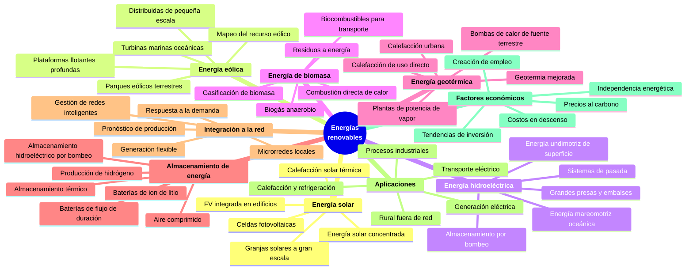

```mermaid
mindmap
  root((<b>Energías<br>renovables</b>))
    <b>Energía solar</b>
      Celdas fotovoltaicas
      Energía solar concentrada
      FV integrada en edificios
      Calefacción solar térmica
      Granjas solares a gran escala
    <b>Energía eólica</b>
      Parques eólicos terrestres
      Turbinas marinas oceánicas
      Plataformas flotantes profundas
      Distribuidas de pequeña escala
      Mapeo del recurso eólico
    <b>Energía hidroeléctrica</b>
      Grandes presas y embalses
      Sistemas de pasada
      Almacenamiento por bombeo
      Energía mareomotriz oceánica
      Energía undimotriz de superficie
    <b>Energía de biomasa</b>
      Combustión directa de calor
      Biogás anaerobio
      Biocombustibles para transporte
      Gasificación de biomasa
      Residuos a energía
    <b>Energía geotérmica</b>
      Plantas de potencia de vapor
      Calefacción de uso directo
      Bombas de calor de fuente terrestre
      Geotermia mejorada
      Calefacción urbana
    <b>Almacenamiento de energía</b>
      Baterías de ion de litio
      Baterías de flujo de duración
      Almacenamiento hidroeléctrico por bombeo
      Aire comprimido
      Almacenamiento térmico
      Producción de hidrógeno
    <b>Integración a la red</b>
      Pronóstico de producción
      Respuesta a la demanda
      Gestión de redes inteligentes
      Generación flexible
      Microrredes locales
    <b>Aplicaciones</b>
      Generación eléctrica
      Calefacción y refrigeración
      Transporte eléctrico
      Procesos industriales
      Rural fuera de red
    <b>Factores económicos</b>
      Costos en descenso
      Creación de empleo
      Independencia energética
      Precios al carbono
      Tendencias de inversión
```
