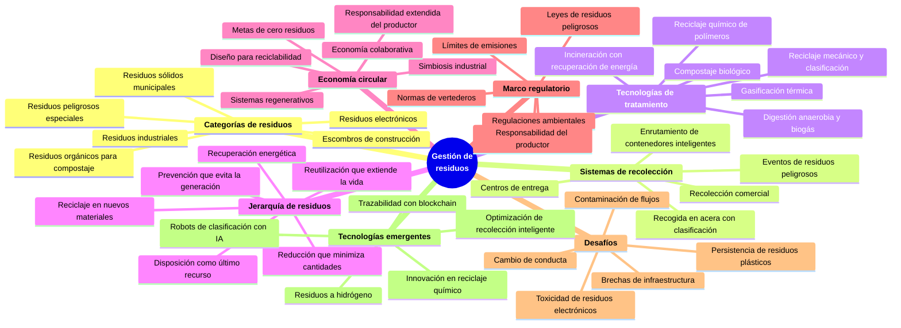

```mermaid
mindmap
  root((<b>Gestión de<br>residuos</b>))
    <b>Categorías de residuos</b>
      Residuos sólidos municipales
      Residuos industriales
      Residuos peligrosos especiales
      Escombros de construcción
      Residuos electrónicos
      Residuos orgánicos para compostaje
    <b>Sistemas de recolección</b>
      Recogida en acera con clasificación
      Centros de entrega
      Recolección comercial
      Eventos de residuos peligrosos
      Enrutamiento de contenedores inteligentes
    <b>Tecnologías de tratamiento</b>
      Reciclaje mecánico y clasificación
      Compostaje biológico
      Digestión anaerobia y biogás
      Incineración con recuperación de energía
      Gasificación térmica
      Reciclaje químico de polímeros
    <b>Jerarquía de residuos</b>
      Prevención que evita la generación
      Reducción que minimiza cantidades
      Reutilización que extiende la vida
      Reciclaje en nuevos materiales
      Recuperación energética
      Disposición como último recurso
    <b>Economía circular</b>
      Diseño para reciclabilidad
      Simbiosis industrial
      Responsabilidad extendida del productor
      Economía colaborativa
      Sistemas regenerativos
      Metas de cero residuos
    <b>Marco regulatorio</b>
      Regulaciones ambientales
      Normas de vertederos
      Límites de emisiones
      Leyes de residuos peligrosos
      Responsabilidad del productor
    <b>Desafíos</b>
      Contaminación de flujos
      Persistencia de residuos plásticos
      Toxicidad de residuos electrónicos
      Brechas de infraestructura
      Cambio de conducta
    <b>Tecnologías emergentes</b>
      Robots de clasificación con IA
      Innovación en reciclaje químico
      Residuos a hidrógeno
      Trazabilidad con blockchain
      Optimización de recolección inteligente
```
