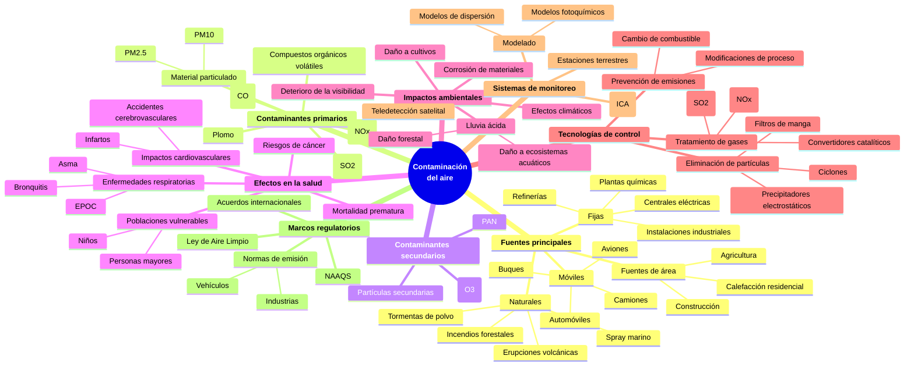

```mermaid
mindmap
  root((<b>Contaminación<br>del aire</b>))
    <b>Fuentes principales</b>
      Fijas
        Centrales eléctricas
        Instalaciones industriales
        Refinerías
        Plantas químicas
      Móviles
        Automóviles
        Camiones
        Aviones
        Buques
      Fuentes de área
        Agricultura
        Construcción
        Calefacción residencial
      Naturales
        Erupciones volcánicas
        Incendios forestales
        Tormentas de polvo
        Spray marino
    <b>Contaminantes primarios</b>
      Material particulado
        PM10
        PM2.5
      Óxidos de nitrógeno (NOx)
      Dióxido de azufre (SO2)
      Monóxido de carbono (CO)
      Compuestos orgánicos volátiles
      Plomo
    <b>Contaminantes secundarios</b>
      Ozono troposférico (O3)
      Partículas secundarias
      PAN
    <b>Efectos en la salud</b>
      Enfermedades respiratorias
        Asma
        Bronquitis
        EPOC
      Impactos cardiovasculares
        Infartos
        Accidentes cerebrovasculares
      Riesgos de cáncer
      Mortalidad prematura
      Poblaciones vulnerables
        Niños
        Personas mayores
    <b>Impactos ambientales</b>
      Lluvia ácida
        Daño forestal
        Daño a ecosistemas acuáticos
      Deterioro de la visibilidad
      Daño a cultivos
      Corrosión de materiales
      Efectos climáticos
    <b>Tecnologías de control</b>
      Eliminación de partículas
        Precipitadores electrostáticos
        Filtros de manga
        Ciclones
      Tratamiento de gases
        Lavadores (SO2)
        Convertidores catalíticos
        RCS (NOx)
      Prevención de emisiones
        Cambio de combustible
        Modificaciones de proceso
    <b>Sistemas de monitoreo</b>
      Estaciones terrestres
      Teledetección satelital
      Índice de calidad del aire (ICA)
      Modelado
        Modelos de dispersión
        Modelos fotoquímicos
    <b>Marcos regulatorios</b>
      Ley de Aire Limpio
      NAAQS
      Normas de emisión
        Vehículos
        Industrias
      Acuerdos internacionales
```
