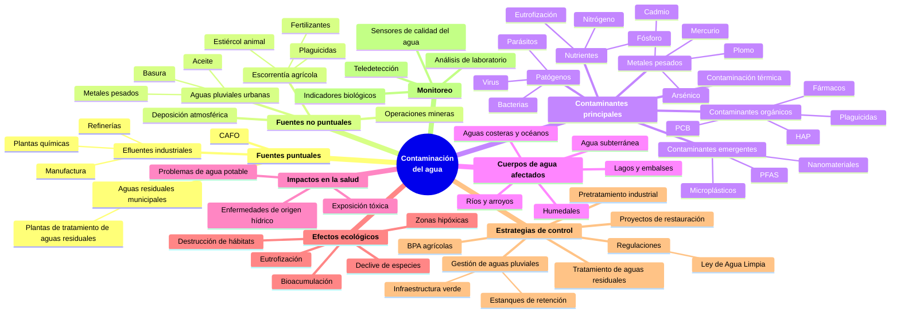

```mermaid
mindmap
  root((<b>Contaminación<br>del agua</b>))
    <b>Fuentes puntuales</b>
      Efluentes industriales
        Plantas químicas
        Refinerías
        Manufactura
      Aguas residuales municipales
        Plantas de tratamiento de aguas residuales
      CAFO
    <b>Fuentes no puntuales</b>
      Escorrentía agrícola
        Fertilizantes
        Plaguicidas
        Estiércol animal
      Aguas pluviales urbanas
        Aceite
        Metales pesados
        Basura
      Deposición atmosférica
      Operaciones mineras
    <b>Contaminantes principales</b>
      Nutrientes
        Nitrógeno
        Fósforo
        Eutrofización
      Metales pesados
        Plomo
        Mercurio
        Cadmio
        Arsénico
      Contaminantes orgánicos
        Plaguicidas
        Fármacos
        PCB
        HAP
      Patógenos
        Bacterias
        Virus
        Parásitos
      Contaminación térmica
      Contaminantes emergentes
        Microplásticos
        PFAS
        Nanomateriales
    <b>Cuerpos de agua afectados</b>
      Ríos y arroyos
      Lagos y embalses
      Aguas costeras y océanos
      Agua subterránea
      Humedales
    <b>Impactos en la salud</b>
      Enfermedades de origen hídrico
      Exposición tóxica
      Problemas de agua potable
    <b>Efectos ecológicos</b>
      Eutrofización
      Zonas hipóxicas
      Bioacumulación
      Destrucción de hábitats
      Declive de especies
    <b>Estrategias de control</b>
      Tratamiento de aguas residuales
      Gestión de aguas pluviales
        Infraestructura verde
        Estanques de retención
      BPA agrícolas
      Pretratamiento industrial
      Regulaciones
        Ley de Agua Limpia
      Proyectos de restauración
    <b>Monitoreo</b>
      Sensores de calidad del agua
      Análisis de laboratorio
      Indicadores biológicos
      Teledetección
```
