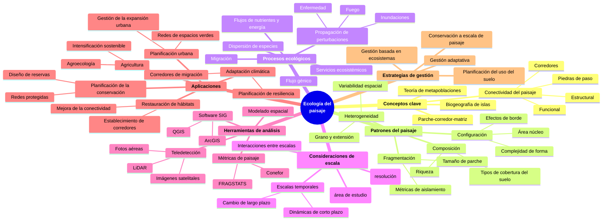

```mermaid
mindmap
  root((<b>Ecología del<br>paisaje</b>))
    <b>Conceptos clave</b>
      Parche-corredor-matriz
      Teoría de metapoblaciones
      Biogeografía de islas
      Conectividad del paisaje
        Estructural
        Funcional
        Corredores
        Piedras de paso
    <b>Patrones del paisaje</b>
      Composición
        Tipos de cobertura del suelo
        Riqueza
      Configuración
        Complejidad de forma
        Efectos de borde
        Área núcleo
      Heterogeneidad
        Variabilidad espacial
        Grano y extensión
      Fragmentación
        Tamaño de parche
        Métricas de aislamiento
    <b>Procesos ecológicos</b>
      Dispersión de especies
      Migración
      Flujo génico
      Propagación de perturbaciones
        Fuego
        Inundaciones
        Enfermedad
      Flujos de nutrientes y energía
      Servicios ecosistémicos
    <b>Consideraciones de escala</b>
      Grano (resolución)
      Extensión (área de estudio)
      Escalas temporales
        Dinámicas de corto plazo
        Cambio de largo plazo
      Interacciones entre escalas
    <b>Herramientas de análisis</b>
      Software SIG
        ArcGIS
        QGIS
      Teledetección
        Imágenes satelitales
        Fotos aéreas
        LiDAR
      Métricas de paisaje
        FRAGSTATS
        Conefor
      Modelado espacial
    <b>Aplicaciones</b>
      Planificación de la conservación
        Diseño de reservas
        Redes protegidas
      Restauración de hábitats
        Establecimiento de corredores
        Mejora de la conectividad
      Planificación urbana
        Redes de espacios verdes
        Gestión de la expansión urbana
      Agricultura
        Agroecología
        Intensificación sostenible
      Adaptación climática
        Corredores de migración
        Planificación de resiliencia
    <b>Estrategias de gestión</b>
      Conservación a escala de paisaje
      Gestión basada en ecosistemas
      Planificación del uso del suelo
      Gestión adaptativa
```
