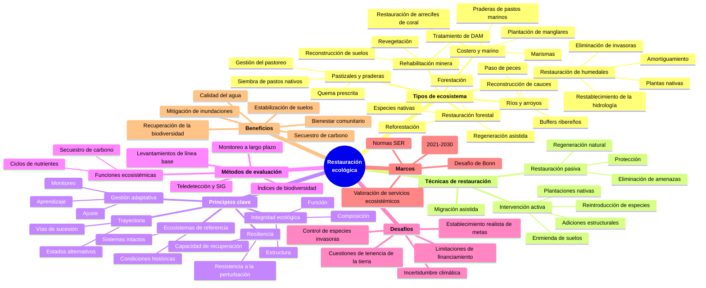

```mermaid
mindmap
  root((<b>Restauración<br>ecológica</b>))
    <b>Tipos de ecosistema</b>
      Restauración forestal
        Reforestación
        Forestación
        Especies nativas
        Regeneración asistida
      Restauración de humedales
        Restablecimiento de la hidrología
        Plantas nativas
        Eliminación de invasoras
        Amortiguamiento
      Pastizales y praderas
        Siembra de pastos nativos
        Quema prescrita
        Gestión del pastoreo
      Ríos y arroyos
        Reconstrucción de cauces
        Buffers ribereños
        Paso de peces
      Costero y marino
        Plantación de manglares
        Restauración de arrecifes de coral
        Praderas de pastos marinos
        Marismas
      Rehabilitación minera
        Reconstrucción de suelos
        Revegetación
        Tratamiento de DAM
    <b>Técnicas de restauración</b>
      Restauración pasiva
        Regeneración natural
        Eliminación de amenazas
        Protección
      Intervención activa
        Enmienda de suelos
        Plantaciones nativas
        Reintroducción de especies
        Adiciones estructurales
      Migración asistida
    <b>Principios clave</b>
      Ecosistemas de referencia
        Condiciones históricas
        Sistemas intactos
      Integridad ecológica
        Estructura
        Composición
        Función
      Resiliencia
        Resistencia a la perturbación
        Capacidad de recuperación
      Trayectoria
        Vías de sucesión
        Estados alternativos
      Gestión adaptativa
        Monitoreo
        Aprendizaje
        Ajuste
    <b>Métodos de evaluación</b>
      Levantamientos de línea base
      Índices de biodiversidad
      Funciones ecosistémicas
        Ciclos de nutrientes
        Secuestro de carbono
      Teledetección y SIG
      Monitoreo a largo plazo
    <b>Desafíos</b>
      Control de especies invasoras
      Incertidumbre climática
      Limitaciones de financiamiento
      Cuestiones de tenencia de la tierra
      Establecimiento realista de metas
    <b>Marcos</b>
      Normas SER
      Decenio de la ONU (2021-2030)
      Desafío de Bonn
      Valoración de servicios ecosistémicos
    <b>Beneficios</b>
      Recuperación de la biodiversidad
      Secuestro de carbono
      Calidad del agua
      Mitigación de inundaciones
      Estabilización de suelos
      Bienestar comunitario
```
