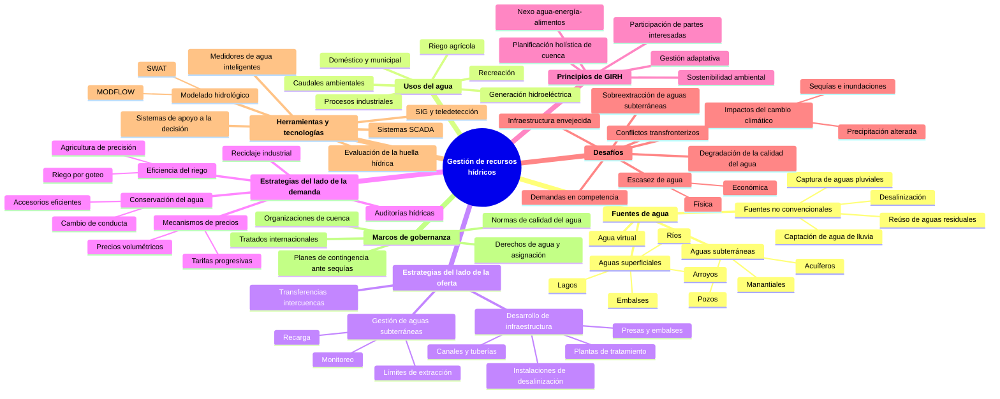

```mermaid
mindmap
  root((<b>Gestión de recursos<br>hídricos</b>))
    <b>Fuentes de agua</b>
      Aguas superficiales
        Ríos
        Lagos
        Embalses
        Arroyos
      Aguas subterráneas
        Acuíferos
        Pozos
        Manantiales
      Fuentes no convencionales
        Desalinización
        Reúso de aguas residuales
        Captación de agua de lluvia
        Captura de aguas pluviales
      Agua virtual
    <b>Usos del agua</b>
      Doméstico y municipal
      Riego agrícola
      Procesos industriales
      Generación hidroeléctrica
      Caudales ambientales
      Recreación
    <b>Estrategias del lado de la oferta</b>
      Desarrollo de infraestructura
        Presas y embalses
        Canales y tuberías
        Plantas de tratamiento
        Instalaciones de desalinización
      Gestión de aguas subterráneas
        Recarga
        Límites de extracción
        Monitoreo
      Transferencias intercuencas
    <b>Estrategias del lado de la demanda</b>
      Conservación del agua
        Accesorios eficientes
        Cambio de conducta
      Eficiencia del riego
        Riego por goteo
        Agricultura de precisión
      Reciclaje industrial
      Mecanismos de precios
        Precios volumétricos
        Tarifas progresivas
      Auditorías hídricas
    <b>Principios de GIRH</b>
      Planificación holística de cuenca
      Participación de partes interesadas
      Nexo agua-energía-alimentos
      Sostenibilidad ambiental
      Gestión adaptativa
    <b>Desafíos</b>
      Escasez de agua
        Física
        Económica
      Sobreextracción de aguas subterráneas
      Degradación de la calidad del agua
      Impactos del cambio climático
        Precipitación alterada
        Sequías e inundaciones
      Demandas en competencia
      Conflictos transfronterizos
      Infraestructura envejecida
    <b>Herramientas y tecnologías</b>
      SIG y teledetección
      Modelado hidrológico
        SWAT
        MODFLOW
      Sistemas de apoyo a la decisión
      Medidores de agua inteligentes
      Sistemas SCADA
      Evaluación de la huella hídrica
    <b>Marcos de gobernanza</b>
      Derechos de agua y asignación
      Organizaciones de cuenca
      Normas de calidad del agua
      Planes de contingencia ante sequías
      Tratados internacionales
```
