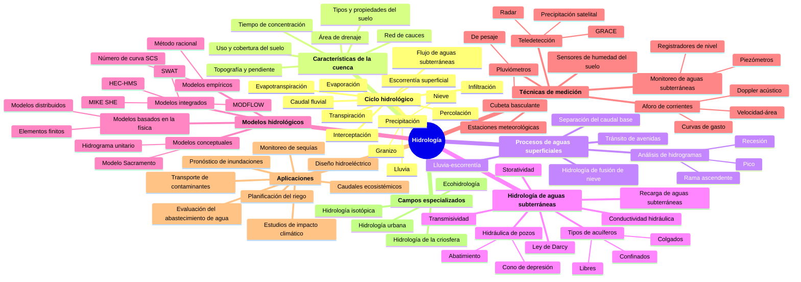

```mermaid
mindmap
  root((<b>Hidrología</b>))
    <b>Ciclo hidrológico</b>
      Precipitación
        Lluvia
        Nieve
        Granizo
      Interceptación
      Evaporación
      Transpiración
      Evapotranspiración
      Infiltración
      Percolación
      Escorrentía superficial
      Caudal fluvial
      Flujo de aguas subterráneas
    <b>Características de la cuenca</b>
      Área de drenaje
      Topografía y pendiente
      Tipos y propiedades del suelo
      Uso y cobertura del suelo
      Red de cauces
      Tiempo de concentración
    <b>Procesos de aguas superficiales</b>
      Lluvia-escorrentía
      Análisis de hidrogramas
        Rama ascendente
        Pico
        Recesión
      Tránsito de avenidas
      Separación del caudal base
      Hidrología de fusión de nieve
    <b>Hidrología de aguas subterráneas</b>
      Tipos de acuíferos
        Confinados
        Libres
        Colgados
      Ley de Darcy
      Conductividad hidráulica
      Transmisividad
      Storatividad
      Recarga de aguas subterráneas
      Hidráulica de pozos
        Abatimiento
        Cono de depresión
    <b>Modelos hidrológicos</b>
      Modelos empíricos
        Método racional
        Número de curva SCS
      Modelos conceptuales
        Hidrograma unitario
        Modelo Sacramento
      Modelos basados en la física
        Modelos distribuidos
        Elementos finitos
      Modelos integrados
        SWAT
        HEC-HMS
        MIKE SHE
        MODFLOW
    <b>Técnicas de medición</b>
      Pluviómetros
        Cubeta basculante
        De pesaje
      Aforo de corrientes
        Curvas de gasto
        Velocidad-área
        Doppler acústico
      Monitoreo de aguas subterráneas
        Piezómetros
        Registradores de nivel
      Sensores de humedad del suelo
      Estaciones meteorológicas
      Teledetección
        Precipitación satelital
        GRACE
        Radar
    <b>Aplicaciones</b>
      Pronóstico de inundaciones
      Evaluación del abastecimiento de agua
      Monitoreo de sequías
      Planificación del riego
      Diseño hidroeléctrico
      Transporte de contaminantes
      Caudales ecosistémicos
      Estudios de impacto climático
    <b>Campos especializados</b>
      Hidrología urbana
      Ecohidrología
      Hidrología isotópica
      Hidrología de la criosfera
```
