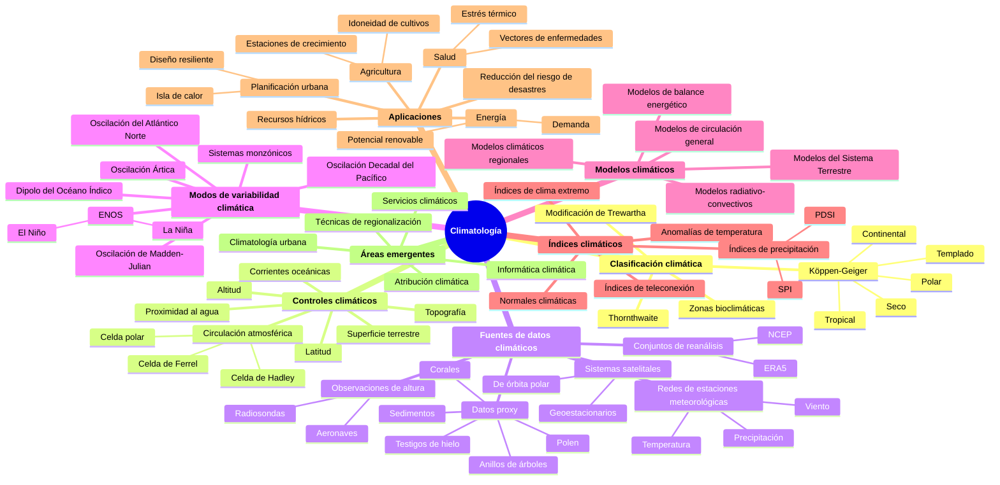

```mermaid
mindmap
  root((<b>Climatología</b>))
    <b>Clasificación climática</b>
      Köppen-Geiger
        Tropical
        Seco
        Templado
        Continental
        Polar
      Thornthwaite
      Modificación de Trewartha
      Zonas bioclimáticas
    <b>Controles climáticos</b>
      Latitud
      Altitud
      Proximidad al agua
      Corrientes oceánicas
      Circulación atmosférica
        Celda de Hadley
        Celda de Ferrel
        Celda polar
      Topografía
      Superficie terrestre
    <b>Fuentes de datos climáticos</b>
      Redes de estaciones meteorológicas
        Temperatura
        Precipitación
        Viento
      Observaciones de altura
        Radiosondas
        Aeronaves
      Sistemas satelitales
        Geoestacionarios
        De órbita polar
      Conjuntos de reanálisis
        ERA5
        NCEP
      Datos proxy
        Testigos de hielo
        Sedimentos
        Anillos de árboles
        Corales
        Polen
    <b>Modos de variabilidad climática</b>
      ENOS
        El Niño
        La Niña
      Oscilación Decadal del Pacífico
      Oscilación del Atlántico Norte
      Oscilación Ártica
      Dipolo del Océano Índico
      Oscilación de Madden-Julian
      Sistemas monzónicos
    <b>Modelos climáticos</b>
      Modelos de balance energético
      Modelos radiativo-convectivos
      Modelos de circulación general
      Modelos climáticos regionales
      Modelos del Sistema Terrestre
    <b>Índices climáticos</b>
      Anomalías de temperatura
      Índices de precipitación
        SPI
        PDSI
      Índices de teleconexión
      Índices de clima extremo
      Normales climáticas
    <b>Aplicaciones</b>
      Agricultura
        Estaciones de crecimiento
        Idoneidad de cultivos
      Recursos hídricos
      Planificación urbana
        Isla de calor
        Diseño resiliente
      Energía
        Potencial renovable
        Demanda
      Salud
        Vectores de enfermedades
        Estrés térmico
      Reducción del riesgo de desastres
    <b>Áreas emergentes</b>
      Servicios climáticos
      Climatología urbana
      Atribución climática
      Técnicas de regionalización
      Informática climática
```
