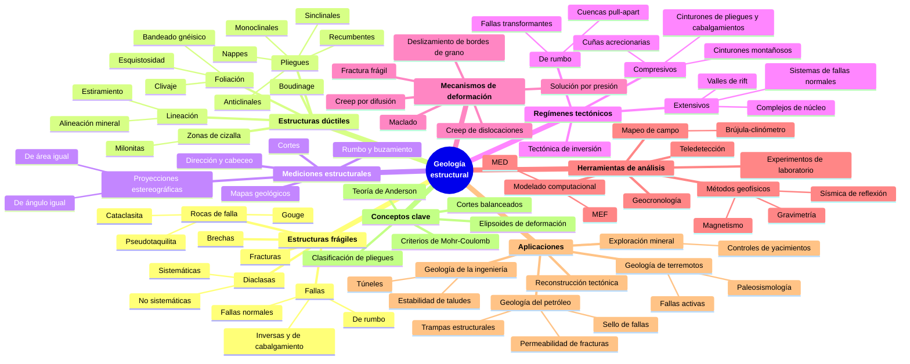

```mermaid
mindmap
  root((<b>Geología<br>estructural</b>))
    <b>Estructuras frágiles</b>
      Fallas
        Fallas normales
        Inversas y de cabalgamiento
        De rumbo
      Diaclasas
        Sistemáticas
        No sistemáticas
      Fracturas
      Brechas
      Rocas de falla
        Gouge
        Cataclasita
        Pseudotaquilita
    <b>Estructuras dúctiles</b>
      Pliegues
        Anticlinales
        Sinclinales
        Monoclinales
        Recumbentes
        Nappes
      Foliación
        Clivaje
        Esquistosidad
        Bandeado gnéisico
      Lineación
        Alineación mineral
        Estiramiento
      Zonas de cizalla
        Milonitas
      Boudinage
    <b>Mediciones estructurales</b>
      Rumbo y buzamiento
      Dirección y cabeceo
      Proyecciones estereográficas
        De área igual
        De ángulo igual
      Cortes
      Mapas geológicos
    <b>Regímenes tectónicos</b>
      Compresivos
        Cinturones montañosos
        Cinturones de pliegues y cabalgamientos
        Cuñas acrecionarias
      Extensivos
        Valles de rift
        Sistemas de fallas normales
        Complejos de núcleo
      De rumbo
        Fallas transformantes
        Cuencas pull-apart
      Tectónica de inversión
    <b>Mecanismos de deformación</b>
      Fractura frágil
      Solución por presión
      Creep de dislocaciones
      Creep por difusión
      Deslizamiento de bordes de grano
      Maclado
    <b>Herramientas de análisis</b>
      Mapeo de campo
        Brújula-clinómetro
      Teledetección
      Métodos geofísicos
        Sísmica de reflexión
        Gravimetría
        Magnetismo
      Experimentos de laboratorio
      Modelado computacional
        MEF
        MED
      Geocronología
    <b>Aplicaciones</b>
      Geología del petróleo
        Trampas estructurales
        Sello de fallas
        Permeabilidad de fracturas
      Exploración mineral
        Controles de yacimientos
      Geología de terremotos
        Fallas activas
        Paleosismología
      Geología de la ingeniería
        Estabilidad de taludes
        Túneles
      Reconstrucción tectónica
    <b>Conceptos clave</b>
      Teoría de Anderson
      Criterios de Mohr-Coulomb
      Clasificación de pliegues
      Cortes balanceados
      Elipsoides de deformación
```
