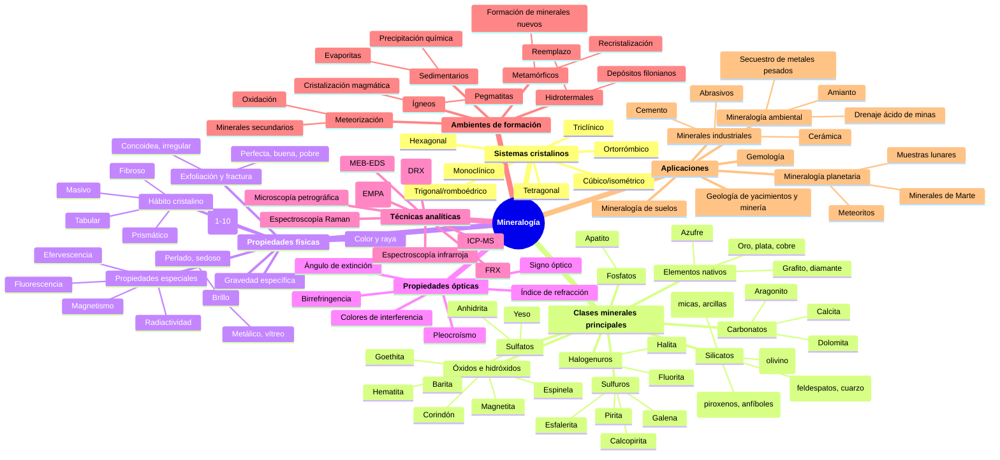

```mermaid
mindmap
  root((<b>Mineralogía</b>))
    <b>Sistemas cristalinos</b>
      Cúbico/isométrico
      Tetragonal
      Ortorrómbico
      Monoclínico
      Triclínico
      Hexagonal
      Trigonal/romboédrico
    <b>Clases minerales principales</b>
      Silicatos
        Nesosilicatos (olivino)
        Inosilicatos (piroxenos, anfíboles)
        Filosilicatos (micas, arcillas)
        Tectosilicatos (feldespatos, cuarzo)
      Carbonatos
        Calcita
        Dolomita
        Aragonito
      Óxidos e hidróxidos
        Hematita
        Magnetita
        Corindón
        Espinela
        Goethita
      Sulfuros
        Pirita
        Galena
        Esfalerita
        Calcopirita
      Sulfatos
        Yeso
        Anhidrita
        Barita
      Halogenuros
        Halita
        Fluorita
      Fosfatos
        Apatito
      Elementos nativos
        Oro, plata, cobre
        Azufre
        Grafito, diamante
    <b>Propiedades físicas</b>
      Dureza de Mohs (1-10)
      Exfoliación y fractura
        Perfecta, buena, pobre
        Concoidea, irregular
      Brillo
        Metálico, vítreo
        Perlado, sedoso
      Color y raya
      Gravedad específica
      Hábito cristalino
        Prismático
        Tabular
        Fibroso
        Masivo
      Propiedades especiales
        Magnetismo
        Fluorescencia
        Radiactividad
        Efervescencia
    <b>Propiedades ópticas</b>
      Índice de refracción
      Birrefringencia
      Pleocroísmo
      Ángulo de extinción
      Signo óptico
      Colores de interferencia
    <b>Técnicas analíticas</b>
      Difracción de rayos X (DRX)
      Microsonda electrónica (EMPA)
      MEB-EDS
      Espectroscopía Raman
      Espectroscopía infrarroja
      FRX
      ICP-MS
      Microscopía petrográfica
    <b>Ambientes de formación</b>
      Ígneos
        Cristalización magmática
        Pegmatitas
      Metamórficos
        Recristalización
        Formación de minerales nuevos
      Hidrotermales
        Depósitos filonianos
        Reemplazo
      Sedimentarios
        Evaporitas
        Precipitación química
      Meteorización
        Minerales secundarios
        Oxidación
    <b>Aplicaciones</b>
      Geología de yacimientos y minería
      Gemología
      Mineralogía ambiental
        Amianto
        Secuestro de metales pesados
        Drenaje ácido de minas
      Minerales industriales
        Cemento
        Cerámica
        Abrasivos
      Mineralogía de suelos
      Mineralogía planetaria
        Meteoritos
        Muestras lunares
        Minerales de Marte
```
