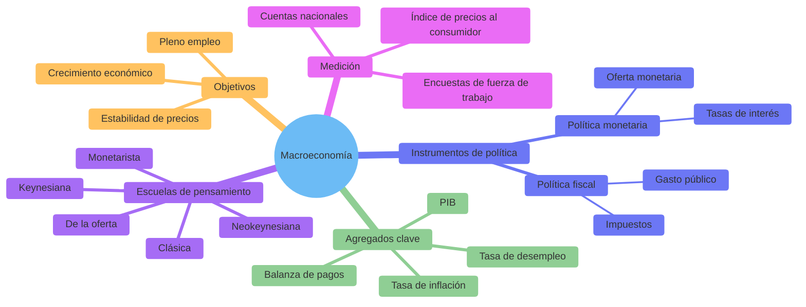

```mermaid
%%{init: {"theme": "base", "themeVariables": {
  "primaryColor": "#E3F2FD",
  "primaryTextColor": "#333",
  "primaryBorderColor": "#1565C0",
  "lineColor": "#4A6FA5",
  "secondaryColor": "#FFF3E0",
  "tertiaryColor": "#E8F5E9"
}}}%%
mindmap
  root((Macroeconomía))
    Objetivos
      Crecimiento económico
      Pleno empleo
      Estabilidad de precios
    Agregados clave
      PIB
      Tasa de desempleo
      Tasa de inflación
      Balanza de pagos
    Instrumentos de política
      Política fiscal
        Gasto público
        Impuestos
      Política monetaria
        Tasas de interés
        Oferta monetaria
    Escuelas de pensamiento
      Clásica
      Keynesiana
      Monetarista
      Neokeynesiana
      De la oferta
    Medición
      Cuentas nacionales
      Índice de precios al consumidor
      Encuestas de fuerza de trabajo
```
