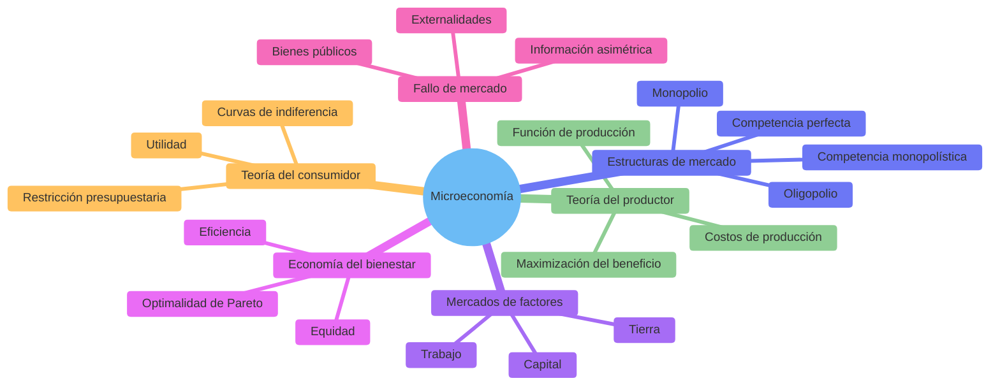

```mermaid
%%{init: {"theme": "base", "themeVariables": {
  "primaryColor": "#E3F2FD",
  "primaryTextColor": "#333",
  "primaryBorderColor": "#1565C0",
  "lineColor": "#4A6FA5",
  "secondaryColor": "#FFF3E0",
  "tertiaryColor": "#E8F5E9"
}}}%%
mindmap
  root((Microeconomía))
    Teoría del consumidor
      Utilidad
      Restricción presupuestaria
      Curvas de indiferencia
    Teoría del productor
      Función de producción
      Costos de producción
      Maximización del beneficio
    Estructuras de mercado
      Competencia perfecta
      Monopolio
      Competencia monopolística
      Oligopolio
    Mercados de factores
      Trabajo
      Capital
      Tierra
    Economía del bienestar
      Eficiencia
      Equidad
      Optimalidad de Pareto
    Fallo de mercado
      Externalidades
      Bienes públicos
      Información asimétrica
```
