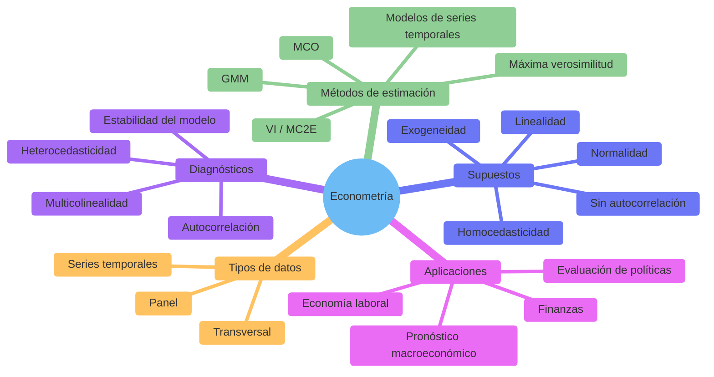

```mermaid
%%{init: {"theme": "base", "themeVariables": {
  "primaryColor": "#E3F2FD",
  "primaryTextColor": "#333",
  "primaryBorderColor": "#1565C0",
  "lineColor": "#4A6FA5",
  "secondaryColor": "#FFF3E0",
  "tertiaryColor": "#E8F5E9"
}}}%%
mindmap
  root((Econometría))
    Tipos de datos
      Transversal
      Series temporales
      Panel
    Métodos de estimación
      MCO
      Máxima verosimilitud
      VI / MC2E
      GMM
      Modelos de series temporales
    Supuestos
      Linealidad
      Exogeneidad
      Homocedasticidad
      Sin autocorrelación
      Normalidad
    Diagnósticos
      Multicolinealidad
      Heterocedasticidad
      Autocorrelación
      Estabilidad del modelo
    Aplicaciones
      Pronóstico macroeconómico
      Evaluación de políticas
      Finanzas
      Economía laboral
```
