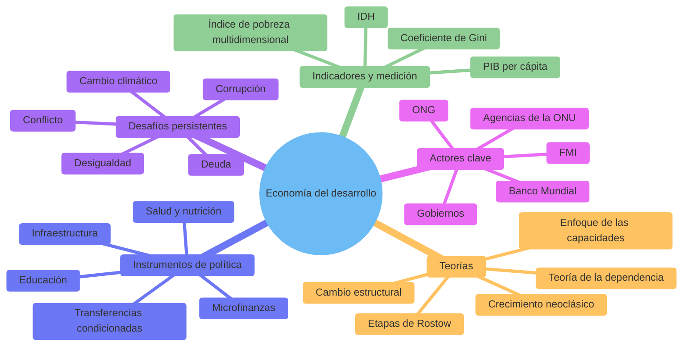

```mermaid
%%{init: {"theme": "base", "themeVariables": {
  "primaryColor": "#E3F2FD",
  "primaryTextColor": "#333",
  "primaryBorderColor": "#1565C0",
  "lineColor": "#4A6FA5",
  "secondaryColor": "#FFF3E0",
  "tertiaryColor": "#E8F5E9"
}}}%%
mindmap
  root((Economía del desarrollo))
    Teorías
      Etapas de Rostow
      Cambio estructural
      Teoría de la dependencia
      Enfoque de las capacidades
      Crecimiento neoclásico
    Indicadores y medición
      IDH
      Índice de pobreza multidimensional
      Coeficiente de Gini
      PIB per cápita
    Instrumentos de política
      Educación
      Salud y nutrición
      Infraestructura
      Microfinanzas
      Transferencias condicionadas
    Desafíos persistentes
      Desigualdad
      Corrupción
      Conflicto
      Cambio climático
      Deuda
    Actores clave
      Gobiernos
      Banco Mundial
      FMI
      Agencias de la ONU
      ONG
```
