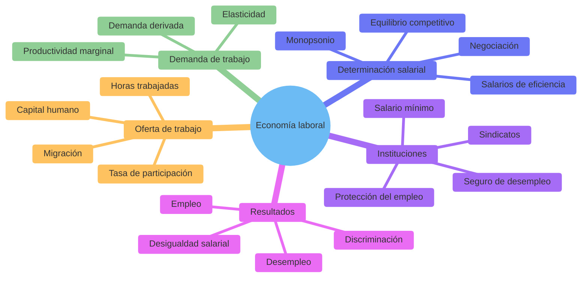

```mermaid
%%{init: {"theme": "base", "themeVariables": {
  "primaryColor": "#E3F2FD",
  "primaryTextColor": "#333",
  "primaryBorderColor": "#1565C0",
  "lineColor": "#4A6FA5",
  "secondaryColor": "#FFF3E0",
  "tertiaryColor": "#E8F5E9"
}}}%%
mindmap
  root((Economía laboral))
    Oferta de trabajo
      Tasa de participación
      Horas trabajadas
      Capital humano
      Migración
    Demanda de trabajo
      Productividad marginal
      Demanda derivada
      Elasticidad
    Determinación salarial
      Equilibrio competitivo
      Monopsonio
      Salarios de eficiencia
      Negociación
    Instituciones
      Sindicatos
      Salario mínimo
      Seguro de desempleo
      Protección del empleo
    Resultados
      Empleo
      Desempleo
      Desigualdad salarial
      Discriminación
```
