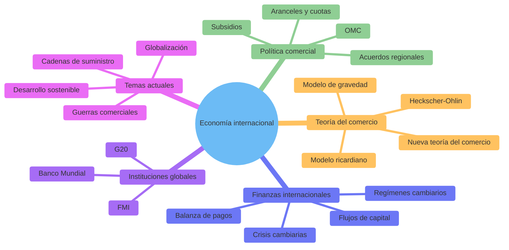

```mermaid
%%{init: {"theme": "base", "themeVariables": {
  "primaryColor": "#E3F2FD",
  "primaryTextColor": "#333",
  "primaryBorderColor": "#1565C0",
  "lineColor": "#4A6FA5",
  "secondaryColor": "#FFF3E0",
  "tertiaryColor": "#E8F5E9"
}}}%%
mindmap
  root((Economía internacional))
    Teoría del comercio
      Modelo ricardiano
      Heckscher-Ohlin
      Nueva teoría del comercio
      Modelo de gravedad
    Política comercial
      Aranceles y cuotas
      Subsidios
      Acuerdos regionales
      OMC
    Finanzas internacionales
      Regímenes cambiarios
      Balanza de pagos
      Crisis cambiarias
      Flujos de capital
    Instituciones globales
      FMI
      Banco Mundial
      G20
    Temas actuales
      Globalización
      Guerras comerciales
      Cadenas de suministro
      Desarrollo sostenible
```
