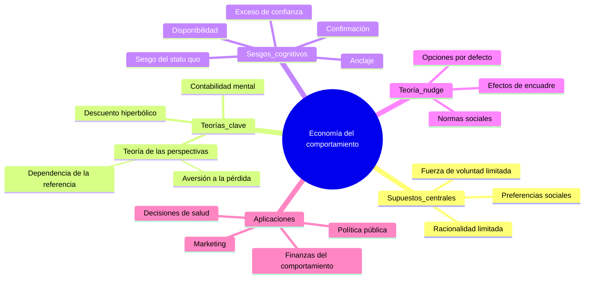

```mermaid
mindmap
  root((Economía del comportamiento))
    Supuestos_centrales
      Racionalidad limitada
      Fuerza de voluntad limitada
      Preferencias sociales
    Teorías_clave
      Teoría de las perspectivas
        Aversión a la pérdida
        Dependencia de la referencia
      Contabilidad mental
      Descuento hiperbólico
    Sesgos_cognitivos
      Anclaje
      Disponibilidad
      Confirmación
      Exceso de confianza
      Sesgo del statu quo
    Teoría_nudge
      Opciones por defecto
      Efectos de encuadre
      Normas sociales
    Aplicaciones
      Política pública
      Finanzas del comportamiento
      Decisiones de salud
      Marketing
```
