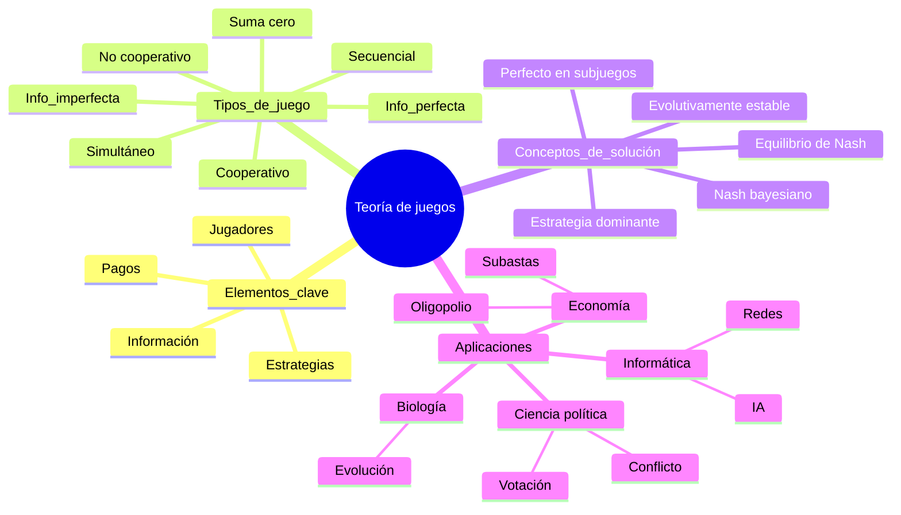

```mermaid
mindmap
  root((Teoría de juegos))
    Elementos_clave
      Jugadores
      Estrategias
      Pagos
      Información
    Tipos_de_juego
      Cooperativo
      No cooperativo
      Suma cero
      Simultáneo
      Secuencial
      Info_perfecta
      Info_imperfecta
    Conceptos_de_solución
      Estrategia dominante
      Equilibrio de Nash
      Perfecto en subjuegos
      Nash bayesiano
      Evolutivamente estable
    Aplicaciones
      Economía
        Oligopolio
        Subastas
      Ciencia política
        Votación
        Conflicto
      Biología
        Evolución
      Informática
        IA
        Redes
```
