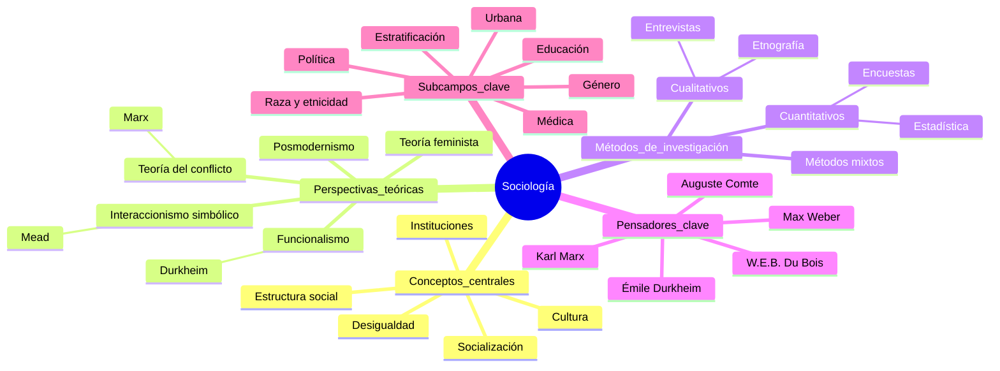

```mermaid
mindmap
  root((Sociología))
    Conceptos_centrales
      Estructura social
      Cultura
      Socialización
      Desigualdad
      Instituciones
    Perspectivas_teóricas
      Funcionalismo
        Durkheim
      Teoría del conflicto
        Marx
      Interaccionismo simbólico
        Mead
      Teoría feminista
      Posmodernismo
    Métodos_de_investigación
      Cuantitativos
        Encuestas
        Estadística
      Cualitativos
        Etnografía
        Entrevistas
      Métodos mixtos
    Pensadores_clave
      Auguste Comte
      Karl Marx
      Émile Durkheim
      Max Weber
      W.E.B. Du Bois
    Subcampos_clave
      Estratificación
      Raza y etnicidad
      Género
      Urbana
      Médica
      Educación
      Política
```
