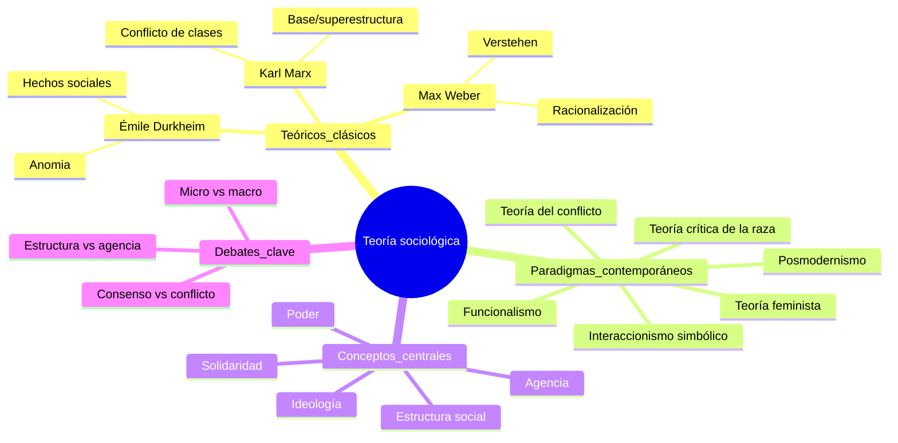

```mermaid
mindmap
  root((Teoría sociológica))
    Teóricos_clásicos
      Karl Marx
        Conflicto de clases
        Base/superestructura
      Émile Durkheim
        Hechos sociales
        Anomia
      Max Weber
        Verstehen
        Racionalización
    Paradigmas_contemporáneos
      Funcionalismo
      Teoría del conflicto
      Interaccionismo simbólico
      Teoría feminista
      Teoría crítica de la raza
      Posmodernismo
    Conceptos_centrales
      Estructura social
      Agencia
      Poder
      Ideología
      Solidaridad
    Debates_clave
      Estructura vs agencia
      Micro vs macro
      Consenso vs conflicto
```
