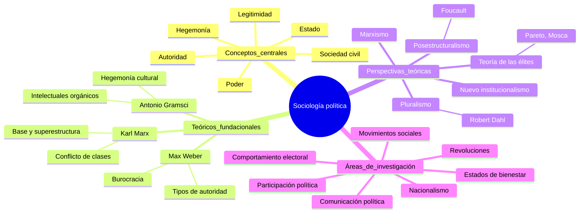

```mermaid
mindmap
  root((Sociología política))
    Conceptos_centrales
      Poder
      Estado
      Legitimidad
      Autoridad
      Sociedad civil
      Hegemonía
    Teóricos_fundacionales
      Karl Marx
        Conflicto de clases
        Base y superestructura
      Max Weber
        Tipos de autoridad
        Burocracia
      Antonio Gramsci
        Hegemonía cultural
        Intelectuales orgánicos
    Perspectivas_teóricas
      Teoría de las élites
        Pareto, Mosca
      Pluralismo
        Robert Dahl
      Marxismo
      Nuevo institucionalismo
      Posestructuralismo
        Foucault
    Áreas_de_investigación
      Participación política
      Movimientos sociales
      Revoluciones
      Comportamiento electoral
      Nacionalismo
      Estados de bienestar
      Comunicación política
```
