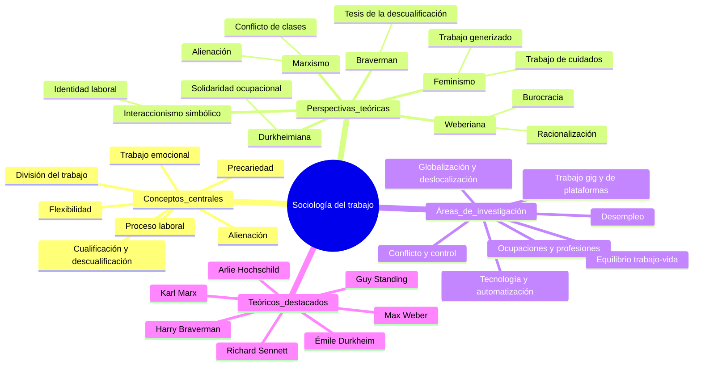

```mermaid
mindmap
  root((Sociología del trabajo))
    Conceptos_centrales
      División del trabajo
      Proceso laboral
      Alienación
      Cualificación y descualificación
      Flexibilidad
      Precariedad
      Trabajo emocional
    Perspectivas_teóricas
      Marxismo
        Alienación
        Conflicto de clases
      Weberiana
        Burocracia
        Racionalización
      Durkheimiana
        Solidaridad ocupacional
      Feminismo
        Trabajo generizado
        Trabajo de cuidados
      Interaccionismo simbólico
        Identidad laboral
      Braverman
        Tesis de la descualificación
    Áreas_de_investigación
      Ocupaciones y profesiones
      Tecnología y automatización
      Trabajo gig y de plataformas
      Equilibrio trabajo-vida
      Desempleo
      Globalización y deslocalización
      Conflicto y control
    Teóricos_destacados
      Karl Marx
      Max Weber
      Émile Durkheim
      Harry Braverman
      Arlie Hochschild
      Richard Sennett
      Guy Standing
```
