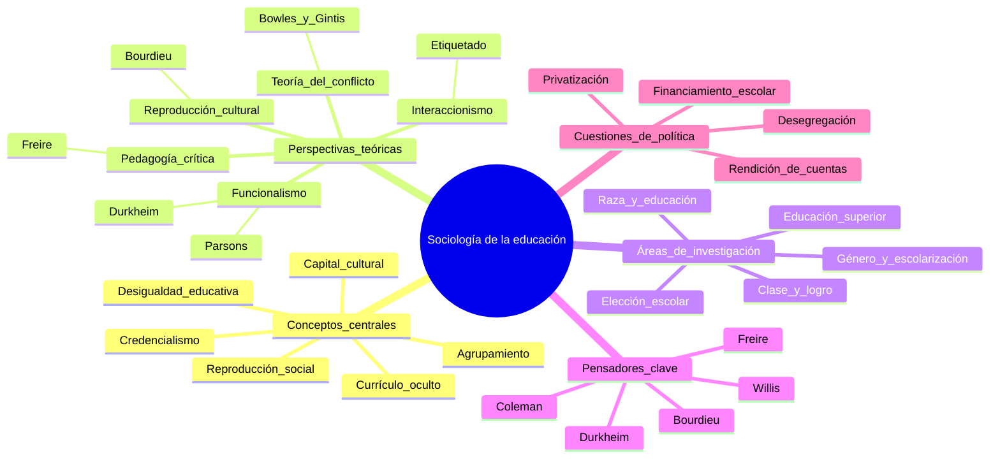

```mermaid
mindmap
  root((Sociología de la educación))
    Conceptos_centrales
      Desigualdad_educativa
      Reproducción_social
      Capital_cultural
      Currículo_oculto
      Agrupamiento
      Credencialismo
    Perspectivas_teóricas
      Funcionalismo
        Durkheim
        Parsons
      Teoría_del_conflicto
        Bowles_y_Gintis
      Interaccionismo
        Etiquetado
      Reproducción_cultural
        Bourdieu
      Pedagogía_crítica
        Freire
    Áreas_de_investigación
      Clase_y_logro
      Raza_y_educación
      Género_y_escolarización
      Educación_superior
      Elección_escolar
    Pensadores_clave
      Durkheim
      Bourdieu
      Coleman
      Freire
      Willis
    Cuestiones_de_política
      Financiamiento_escolar
      Desegregación
      Rendición_de_cuentas
      Privatización
```
