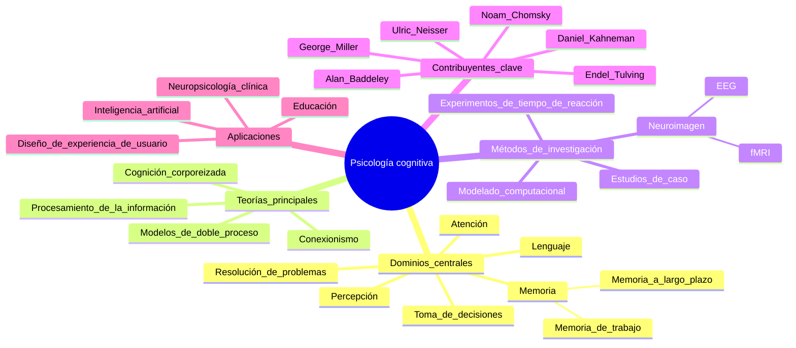

```mermaid
mindmap
  root((Psicología cognitiva))
    Dominios_centrales
      Percepción
      Atención
      Memoria
        Memoria_de_trabajo
        Memoria_a_largo_plazo
      Lenguaje
      Resolución_de_problemas
      Toma_de_decisiones
    Teorías_principales
      Procesamiento_de_la_información
      Conexionismo
      Cognición_corporeizada
      Modelos_de_doble_proceso
    Métodos_de_investigación
      Experimentos_de_tiempo_de_reacción
      Neuroimagen
        fMRI
        EEG
      Modelado_computacional
      Estudios_de_caso
    Contribuyentes_clave
      Ulric_Neisser
      George_Miller
      Noam_Chomsky
      Endel_Tulving
      Alan_Baddeley
      Daniel_Kahneman
    Aplicaciones
      Educación
      Inteligencia_artificial
      Neuropsicología_clínica
      Diseño_de_experiencia_de_usuario
```
