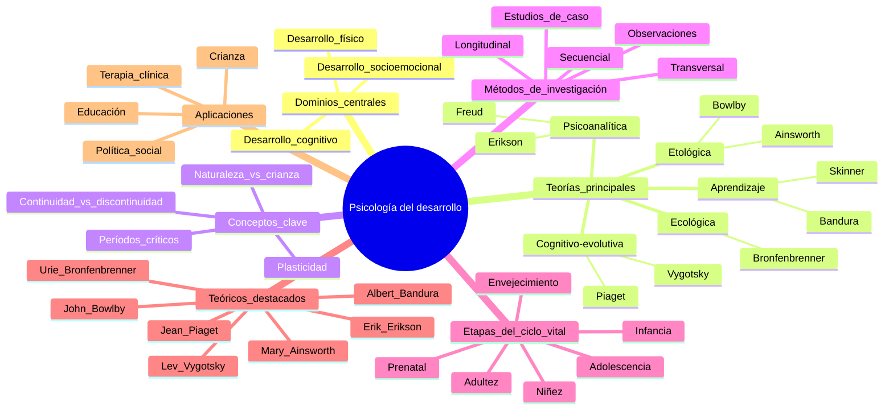

```mermaid
mindmap
  root((Psicología del desarrollo))
    Dominios_centrales
      Desarrollo_físico
      Desarrollo_cognitivo
      Desarrollo_socioemocional
    Teorías_principales
      Psicoanalítica
        Freud
        Erikson
      Aprendizaje
        Skinner
        Bandura
      Cognitivo-evolutiva
        Piaget
        Vygotsky
      Etológica
        Bowlby
        Ainsworth
      Ecológica
        Bronfenbrenner
    Conceptos_clave
      Naturaleza_vs_crianza
      Continuidad_vs_discontinuidad
      Períodos_críticos
      Plasticidad
    Métodos_de_investigación
      Longitudinal
      Transversal
      Secuencial
      Estudios_de_caso
      Observaciones
    Etapas_del_ciclo_vital
      Prenatal
      Infancia
      Niñez
      Adolescencia
      Adultez
      Envejecimiento
    Teóricos_destacados
      Jean_Piaget
      Lev_Vygotsky
      Erik_Erikson
      John_Bowlby
      Mary_Ainsworth
      Albert_Bandura
      Urie_Bronfenbrenner
    Aplicaciones
      Educación
      Crianza
      Terapia_clínica
      Política_social
```
