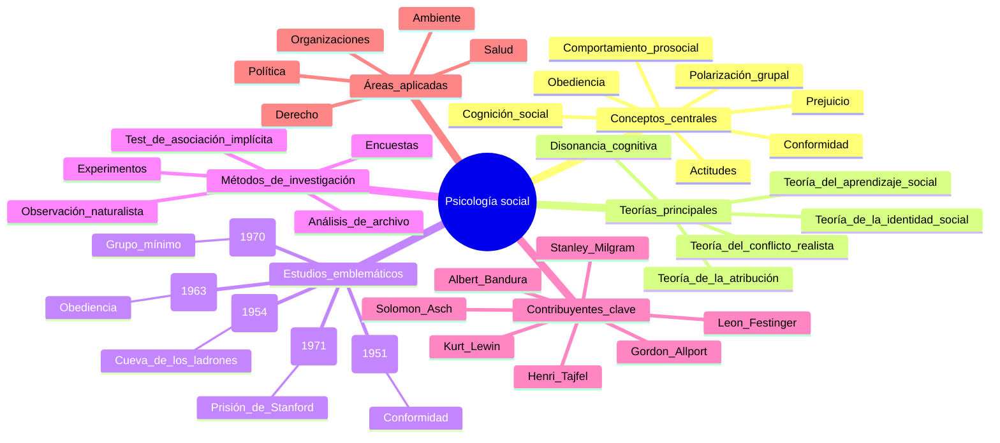

```mermaid
mindmap
  root((Psicología social))
    Conceptos_centrales
      Cognición_social
      Actitudes
      Conformidad
      Obediencia
      Polarización_grupal
      Prejuicio
      Comportamiento_prosocial
    Teorías_principales
      Teoría_de_la_atribución
      Disonancia_cognitiva
      Teoría_de_la_identidad_social
      Teoría_del_aprendizaje_social
      Teoría_del_conflicto_realista
    Estudios_emblemáticos
      Asch_(1951)
        Conformidad
      Milgram_(1963)
        Obediencia
      Zimbardo_(1971)
        Prisión_de_Stanford
      Sherif_(1954)
        Cueva_de_los_ladrones
      Tajfel_(1970)
        Grupo_mínimo
    Métodos_de_investigación
      Experimentos
      Encuestas
      Observación_naturalista
      Análisis_de_archivo
      Test_de_asociación_implícita
    Contribuyentes_clave
      Gordon_Allport
      Kurt_Lewin
      Leon_Festinger
      Solomon_Asch
      Stanley_Milgram
      Albert_Bandura
      Henri_Tajfel
    Áreas_aplicadas
      Salud
      Organizaciones
      Derecho
      Ambiente
      Política
```
