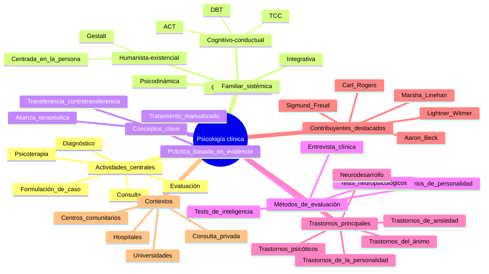

```mermaid
mindmap
  root((Psicología clínica))
    Actividades_centrales
      Evaluación
      Diagnóstico
      Formulación_de_caso
      Psicoterapia
      Consulta
    Orientación_teórica
      Cognitivo-conductual
        TCC
        ACT
        DBT
      Psicodinámica
      Humanista-existencial
        Centrada_en_la_persona
        Gestalt
      Familiar_sistémica
      Integrativa
    Conceptos_clave
      Práctica_basada_en_evidencia
      Alianza_terapéutica
      Transferencia_contratransferencia
      Tratamiento_manualizado
    Métodos_de_evaluación
      Entrevista_clínica
      Tests_de_inteligencia
      Inventarios_de_personalidad
      Tests_neuropsicológicos
    Trastornos_principales
      Trastornos_del_ánimo
      Trastornos_de_ansiedad
      Trastornos_psicóticos
      Trastornos_de_la_personalidad
      Neurodesarrollo
    Contribuyentes_destacados
      Lightner_Witmer
      Sigmund_Freud
      Aaron_Beck
      Carl_Rogers
      Marsha_Linehan
    Contextos
      Hospitales
      Consulta_privada
      Universidades
      Centros_comunitarios
```
