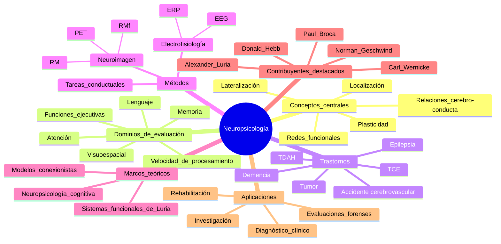

```mermaid
mindmap
  root((Neuropsicología))
    Conceptos_centrales
      Relaciones_cerebro-conducta
      Localización
      Lateralización
      Plasticidad
      Redes_funcionales
    Dominios_de_evaluación
      Memoria
      Atención
      Funciones_ejecutivas
      Lenguaje
      Visuoespacial
      Velocidad_de_procesamiento
    Trastornos
      TCE
      Accidente cerebrovascular
      Demencia
      Epilepsia
      TDAH
      Tumor
    Métodos
      Neuroimagen
        RM
        RMf
        PET
      Electrofisiología
        EEG
        ERP
      Tareas_conductuales
    Marcos_teóricos
      Neuropsicología_cognitiva
      Sistemas_funcionales_de_Luria
      Modelos_conexionistas
    Contribuyentes_destacados
      Paul_Broca
      Carl_Wernicke
      Alexander_Luria
      Donald_Hebb
      Norman_Geschwind
    Aplicaciones
      Diagnóstico_clínico
      Rehabilitación
      Evaluaciones_forenses
      Investigación
```
