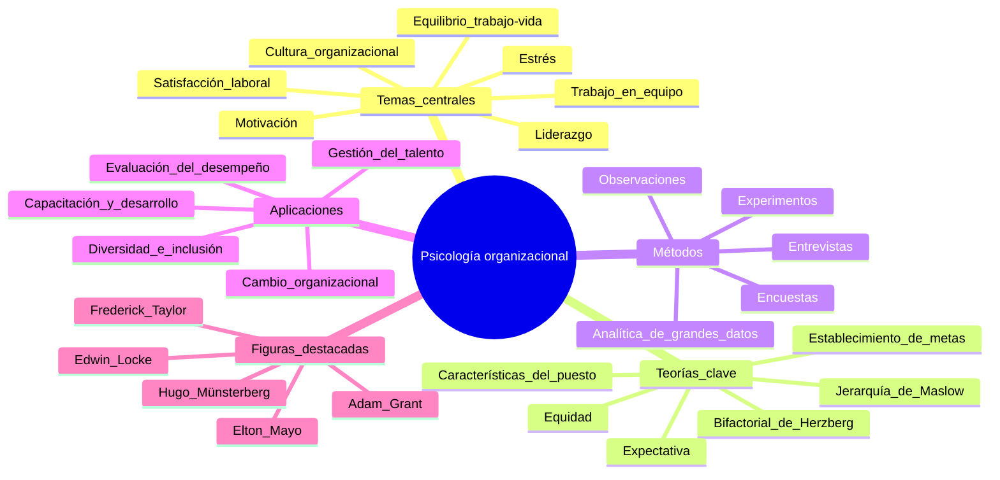

```mermaid
mindmap
  root((Psicología organizacional))
    Temas_centrales
      Satisfacción_laboral
      Motivación
      Liderazgo
      Trabajo_en_equipo
      Cultura_organizacional
      Estrés
      Equilibrio_trabajo-vida
    Teorías_clave
      Jerarquía_de_Maslow
      Bifactorial_de_Herzberg
      Establecimiento_de_metas
      Expectativa
      Equidad
      Características_del_puesto
    Métodos
      Encuestas
      Experimentos
      Entrevistas
      Observaciones
      Analítica_de_grandes_datos
    Aplicaciones
      Gestión_del_talento
      Capacitación_y_desarrollo
      Evaluación_del_desempeño
      Cambio_organizacional
      Diversidad_e_inclusión
    Figuras_destacadas
      Hugo_Münsterberg
      Frederick_Taylor
      Elton_Mayo
      Edwin_Locke
      Adam_Grant
```
