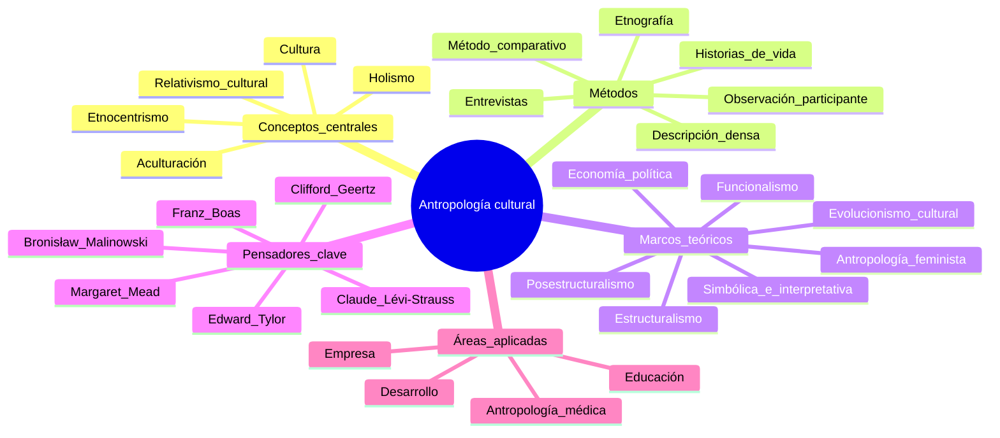

```mermaid
mindmap
  root((Antropología cultural))
    Conceptos_centrales
      Cultura
      Relativismo_cultural
      Holismo
      Etnocentrismo
      Aculturación
    Métodos
      Etnografía
      Observación_participante
      Entrevistas
      Historias_de_vida
      Método_comparativo
      Descripción_densa
    Marcos_teóricos
      Evolucionismo_cultural
      Funcionalismo
      Estructuralismo
      Simbólica_e_interpretativa
      Economía_política
      Posestructuralismo
      Antropología_feminista
    Pensadores_clave
      Edward_Tylor
      Franz_Boas
      Bronisław_Malinowski
      Claude_Lévi-Strauss
      Margaret_Mead
      Clifford_Geertz
    Áreas_aplicadas
      Antropología_médica
      Desarrollo
      Educación
      Empresa
```
