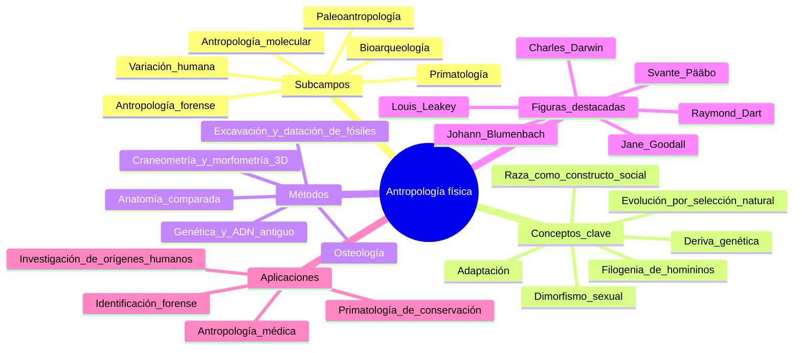

```mermaid
mindmap
  root((Antropología física))
    Subcampos
      Paleoantropología
      Primatología
      Variación_humana
      Bioarqueología
      Antropología_forense
      Antropología_molecular
    Conceptos_clave
      Evolución_por_selección_natural
      Adaptación
      Filogenia_de_homininos
      Raza_como_constructo_social
      Deriva_genética
      Dimorfismo_sexual
    Métodos
      Excavación_y_datación_de_fósiles
      Anatomía_comparada
      Genética_y_ADN_antiguo
      Osteología
      Craneometría_y_morfometría_3D
    Figuras_destacadas
      Johann_Blumenbach
      Charles_Darwin
      Raymond_Dart
      Louis_Leakey
      Jane_Goodall
      Svante_Pääbo
    Aplicaciones
      Investigación_de_orígenes_humanos
      Identificación_forense
      Antropología_médica
      Primatología_de_conservación
```
