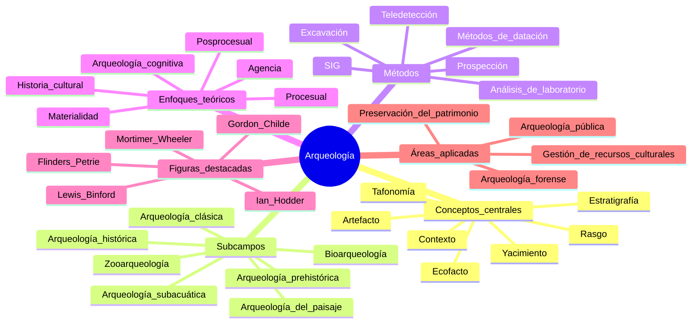

```mermaid
mindmap
  root((Arqueología))
    Conceptos_centrales
      Estratigrafía
      Contexto
      Artefacto
      Ecofacto
      Rasgo
      Yacimiento
      Tafonomía
    Subcampos
      Arqueología_prehistórica
      Arqueología_histórica
      Arqueología_clásica
      Arqueología_subacuática
      Bioarqueología
      Zooarqueología
      Arqueología_del_paisaje
    Métodos
      Prospección
      Excavación
      SIG
      Teledetección
      Métodos_de_datación
      Análisis_de_laboratorio
    Enfoques_teóricos
      Historia_cultural
      Procesual
      Posprocesual
      Agencia
      Materialidad
      Arqueología_cognitiva
    Figuras_destacadas
      Flinders_Petrie
      Mortimer_Wheeler
      Gordon_Childe
      Lewis_Binford
      Ian_Hodder
    Áreas_aplicadas
      Gestión_de_recursos_culturales
      Preservación_del_patrimonio
      Arqueología_pública
      Arqueología_forense
```
