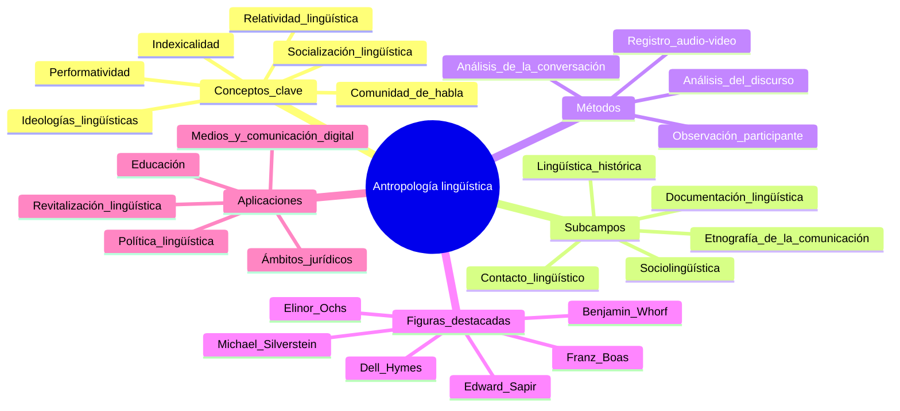

```mermaid
mindmap
  root((Antropología lingüística))
    Conceptos_clave
      Relatividad_lingüística
      Indexicalidad
      Socialización_lingüística
      Comunidad_de_habla
      Ideologías_lingüísticas
      Performatividad
    Subcampos
      Etnografía_de_la_comunicación
      Sociolingüística
      Lingüística_histórica
      Contacto_lingüístico
      Documentación_lingüística
    Métodos
      Observación_participante
      Registro_audio-video
      Análisis_de_la_conversación
      Análisis_del_discurso
    Figuras_destacadas
      Franz_Boas
      Edward_Sapir
      Benjamin_Whorf
      Dell_Hymes
      Michael_Silverstein
      Elinor_Ochs
    Aplicaciones
      Política_lingüística
      Educación
      Ámbitos_jurídicos
      Medios_y_comunicación_digital
      Revitalización_lingüística
```
