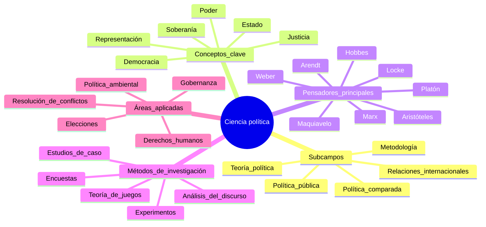

```mermaid
mindmap
  root((Ciencia política))
    Subcampos
      Teoría_política
      Política_comparada
      Relaciones_internacionales
      Política_pública
      Metodología
    Conceptos_clave
      Poder
      Estado
      Soberanía
      Democracia
      Justicia
      Representación
    Pensadores_principales
      Platón
      Aristóteles
      Maquiavelo
      Hobbes
      Locke
      Marx
      Weber
      Arendt
    Métodos_de_investigación
      Estudios_de_caso
      Encuestas
      Experimentos
      Teoría_de_juegos
      Análisis_del_discurso
    Áreas_aplicadas
      Gobernanza
      Elecciones
      Resolución_de_conflictos
      Derechos_humanos
      Política_ambiental
```
