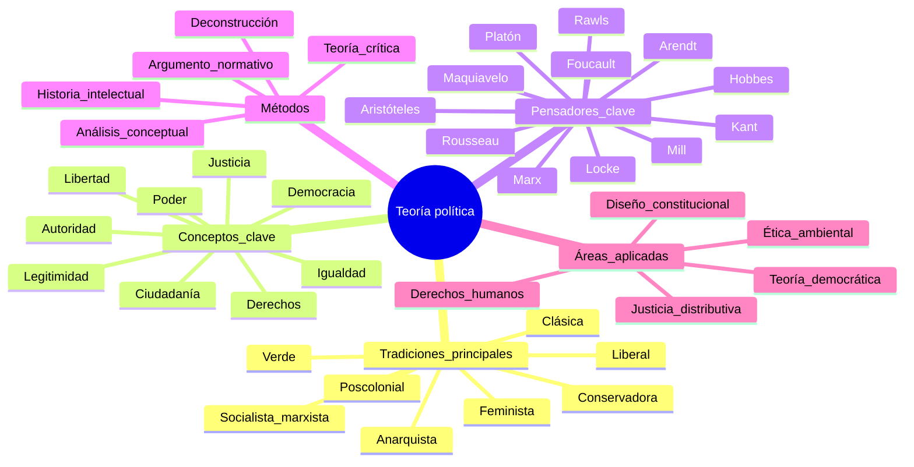

```mermaid
mindmap
  root((Teoría política))
    Tradiciones_principales
      Clásica
      Liberal
      Conservadora
      Socialista_marxista
      Anarquista
      Feminista
      Poscolonial
      Verde
    Conceptos_clave
      Justicia
      Libertad
      Igualdad
      Derechos
      Poder
      Autoridad
      Legitimidad
      Democracia
      Ciudadanía
    Pensadores_clave
      Platón
      Aristóteles
      Maquiavelo
      Hobbes
      Locke
      Rousseau
      Kant
      Marx
      Mill
      Rawls
      Arendt
      Foucault
    Métodos
      Argumento_normativo
      Análisis_conceptual
      Historia_intelectual
      Teoría_crítica
      Deconstrucción
    Áreas_aplicadas
      Diseño_constitucional
      Derechos_humanos
      Justicia_distributiva
      Ética_ambiental
      Teoría_democrática
```
