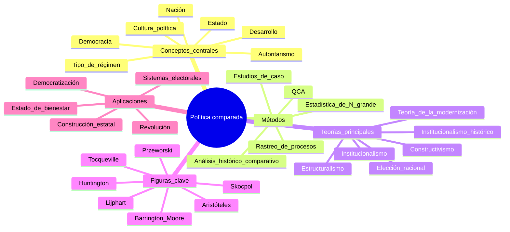

```mermaid
mindmap
  root((Política comparada))
    Conceptos_centrales
      Estado
      Nación
      Tipo_de_régimen
      Democracia
      Autoritarismo
      Cultura_política
      Desarrollo
    Métodos
      Estudios_de_caso
      Análisis_histórico_comparativo
      Estadística_de_N_grande
      QCA
      Rastreo_de_procesos
    Teorías_principales
      Teoría_de_la_modernización
      Estructuralismo
      Institucionalismo
      Elección_racional
      Constructivismo
      Institucionalismo_histórico
    Figuras_clave
      Aristóteles
      Tocqueville
      Barrington_Moore
      Huntington
      Skocpol
      Lijphart
      Przeworski
    Aplicaciones
      Democratización
      Construcción_estatal
      Estado_de_bienestar
      Sistemas_electorales
      Revolución
```
