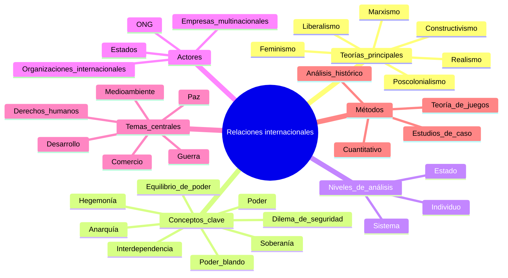

```mermaid
mindmap
  root((Relaciones internacionales))
    Teorías_principales
      Realismo
      Liberalismo
      Constructivismo
      Marxismo
      Feminismo
      Poscolonialismo
    Conceptos_clave
      Anarquía
      Soberanía
      Poder
      Equilibrio_de_poder
      Dilema_de_seguridad
      Interdependencia
      Hegemonía
      Poder_blando
    Niveles_de_análisis
      Sistema
      Estado
      Individuo
    Actores
      Estados
      Organizaciones_internacionales
      ONG
      Empresas_multinacionales
    Temas_centrales
      Guerra
      Paz
      Comercio
      Desarrollo
      Medioambiente
      Derechos_humanos
    Métodos
      Análisis_histórico
      Estudios_de_caso
      Cuantitativo
      Teoría_de_juegos
```
